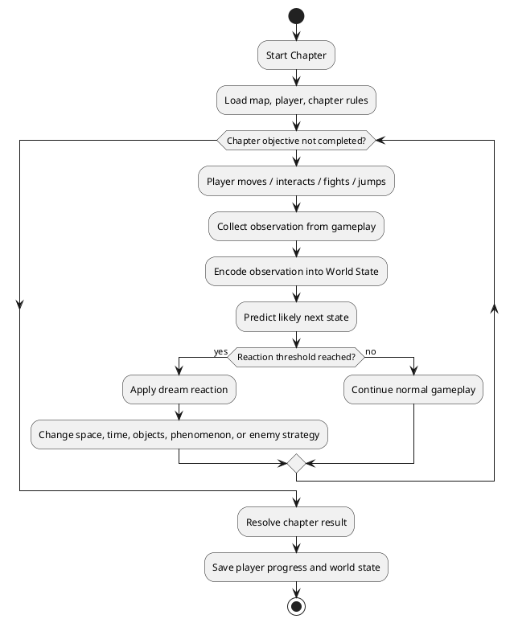
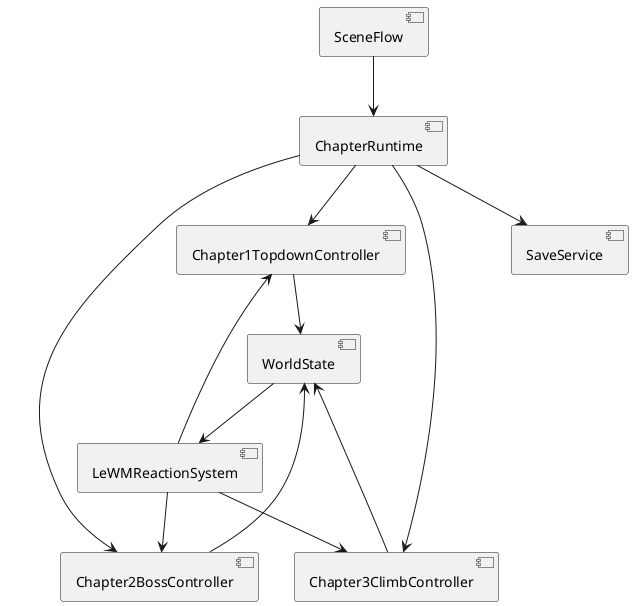
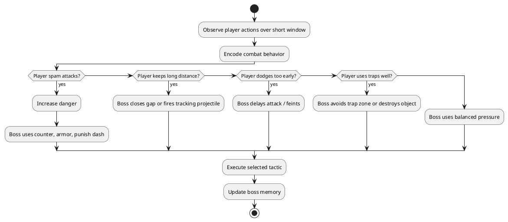
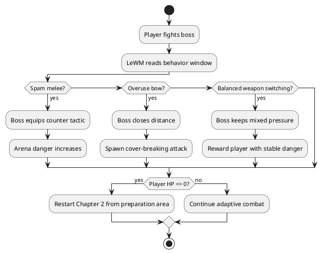

# Giac Mo Co Tich - Gameplay Direction Chapters 1-3

## Godot 2D Adventure with LeWorldModel-inspired World Reaction

> Trang thai: Ban thiet ke gameplay sau khi loai bo huong Visual Novel thuan.
> Target: PC Windows, Godot 2D, story content tieng Viet.
> Ghi chu: "LeWorkModel" trong trao doi duoc hieu la "LeWorldModel-inspired system" / "LeWM-inspired system".

---

# 1. Dinh huong moi

Game khong con la visual novel. Huong moi la 2D adventure/action theo chapter, moi chapter co gameplay loop rieng nhung dung chung he thong state:

- Chapter 1: topdown nghieng, di chuyen WASD, kham pha rung, gap Ly Thong, cung nhau roi map.
- Chapter 2: topdown player-vs-boss offline, co doan chuan bi, sau do solo boss giong tinh than Soul Knight.
- Chapter 3: strict vertical climbing / precision jump giong Jump King.

LeWorldModel-inspired system khong thay nguoi choi ra quyet dinh. No quan sat hanh vi, cap nhat state cua the gioi, va tao phan ung ve khong gian, thoi gian, su vat, hien tuong, cung nhu chien thuat boss.

Design pillar moi: day la game qua man, moi man co mot loi choi rieng. Vi vay kien truc khong nen ep tat ca chapter vao mot controller gameplay duy nhat. Nen dung shared systems cho save, world state, LeWM reaction, input mapping, scene loading; con moi chapter co controller rieng cho movement/combat/physics.

Trade-off cua huong "moi man mot loi choi":

| Huong | Scalable | Maintainable | Security | Performance | User Experience |
| :--- | :--- | :--- | :--- | :--- | :--- |
| Mot gameplay loop duy nhat cho ca game | De scale noi dung cung loai | De maintain nhat | An toan offline | Nhe | De nham neu chapter dai |
| Moi chapter mot gameplay loop, dung shared systems | Scale tot neu module ro | Can discipline ve interface | An toan offline | Van tot tren PC | Da dang, hop game qua man |
| Moi chapter lam nhu mini-game rieng biet, it shared code | De prototype nhanh | De no technical debt | An toan offline | Co the trung lap asset/script | Da dang nhung cam giac roi rac |

Khuyen nghi: moi chapter co controller rieng, nhung dung chung `WorldState`, `LeWMReactionSystem`, `SaveService`, `SceneFlow`, `InputRouter`.

---

# 2. Core runtime flow

Shared world state de xuat:

| State | Y nghia | Dung o chapter nao |
| :--- | :--- | :--- |
| `trust_ly_thong` | Muc do Thach Sanh tin Ly Thong | Chapter 1, sau nay anh huong betrayal |
| `suspicion` | Muc nghi ngo ve su bat thuong | Chapter 1-3 |
| `courage` | Muc san sang doi mat nguy hiem | Chapter 2-3 |
| `knowledge` | Muc hieu ve Rung Mong / quai / lore | Chapter 1-2 |
| `danger` | Muc nguy hiem hien tai cua the gioi | Chapter 2-3 |
| `dream_stability` | Do on dinh cua giac mo | All chapters |
| `combat_style_spam` | Muc do nguoi choi spam attack | Chapter 2 |
| `combat_style_kite` | Muc do nguoi choi giu khoang cach | Chapter 2 |
| `climb_confidence` | Muc do on dinh khi leo treo | Chapter 3 |

Chapter runtime interface de xuat:

---

# 3. Chapter 1 - Rung Ram Topdown Nghieng

## 3.1 Flow da duoc duyet

Chapter 1 la man gioi thieu. Camera topdown nghieng giong Pokemon ROM Hack 2D. Nguoi choi dieu khien Thach Sanh di chuyen co ban bang WASD trong rung ram. Ly Thong tim den, hai nguoi tro chuyen, roi cung nhau di ra khoi map. Muc tieu cua chapter la onboarding: gioi thieu nhan vat, movement, interaction, khong khi Rung Mong.

## 3.2 Gameplay loop

1. Player spawn tai khu vuc goc cay / bia rung.
2. UI hien objective ngan: "Di chuyen quanh rung".
3. Player hoc WASD, collision voi cay, da, bui co, lo mon.
4. Player co the interact voi 2-3 object optional:
   - Goc da co tieng thi tham.
   - Dau chan la tren dat.
   - Cay co thu co vet chem cu.
5. Ly Thong xuat hien tu ria map.
6. Dialogue ngan trong gameplay, khong chuyen thanh visual novel dai.
7. Ly Thong de nghi di cung.
8. Player di theo hoac di truoc Ly Thong den exit.
9. Khi ca hai cham exit trigger, chapter ket thuc.

## 3.3 LeWM-inspired applications

### Khong gian

Rung khong procedural day du, nhung co phan ung nhe:

- Player di lech lo mon qua lau: suong day hon, cay che tam nhin hon.
- Player quay lai goc da nhieu lan: mo mot whisper event.
- Player di theo Ly Thong ngay: exit path sang hon, it hien tuong la.
- Player tu y kham pha: mo dau chan / clue tang `suspicion`.

### Thoi gian

Thoi gian trong chapter co the la "dream time":

- 0-2 phut: anh sang chieu, an toan.
- 2-4 phut: rung bat dau toi, tieng con trung ro hon.
- Tren 4 phut: tieng thi tham tang, `dream_stability` giam nhe.

### Su vat

Object co the ghi nhan interaction:

- Goc da: tang `knowledge`.
- Dau chan la: tang `suspicion`.
- Cay bi chem: tang clue ve than phan Thach Sanh.
- Bui co dong day: tao tin hieu ve nguy hiem sap toi.

### Hien tuong

- Whisper cua Rung Mong.
- Suong mo tu ria man hinh.
- La rung nguoc chieu gio.
- Anh sang chuyen mau khi Ly Thong noi cau co an y.

## 3.4 Trade-off Chapter 1

| Phuong an | Scalable | Maintainable | Security | Performance | User Experience |
| :--- | :--- | :--- | :--- | :--- | :--- |
| Map co dinh, event trigger don gian | De them map va object moi | Rat de maintain | Local-only, an toan | Rat nhe | Ro rang, phu hop onboarding |
| Map co reaction theo LeWM state | Tot, tao nen "Rung Mong song" | Can quan ly state/rule ro | Van an toan neu rule-based | Nhe neu chi effect/trigger | Ky bi hon, co replay value |
| Map procedural that | Kho kiem soat story | Kho debug va QA | Van an toan | Co the nhe-vua | De lam nguoi choi lac, khong phu hop intro |

Khuyen nghi: map co dinh + LeWM reaction layer nhe.

## 3.5 Definition of Done

- WASD movement muot.
- Camera topdown nghieng theo player.
- Collision dung voi cay/da/bui.
- Ly Thong co spawn, walk-to-player, follow-to-exit.
- It nhat 3 interactable object.
- It nhat 2 dream reaction dua tren hanh vi player.
- Chapter end trigger khi player va Ly Thong den exit.

---

# 4. Chapter 2 - Solo Boss Combat Truc Tiep

## 4.1 Flow da duoc duyet va dieu chinh

Chapter 2 khong dung boss phase co dinh. "PVP" trong chapter nay da duoc xac nhan la player-vs-boss realtime offline, camera topdown giong Soul Knight. Nguoi choi vao map, co doan chuan bi ngan:

- Nguoi choi co ca riu va cung tu dau.
- Bam phim `1` de chon riu.
- Bam phim `2` de chon cung.
- Doc dau vet.
- Ne cam bay.
- Di tiep den khong gian boss.

Sau do la solo boss combat realtime: nhanh, truc tiep, doc hanh vi, ne don, tan cong, doi vu khi, dung vat pham/khong gian. Player co HP. Khi HP ve 0, player choi lai tu dau Chapter 2, bao gom ca doan chuan bi truoc boss. Boss co thanh mau UI ro. Cung aim bang mouse.

## 4.2 Gameplay loop

1. Player vao hang / khu vuc truoc boss.
2. UI huong dan doi vu khi: `1` = riu, `2` = cung.
3. Player doc dau vet / tranh khac de hieu boss.
4. Player ne 2-3 cam bay co ban.
5. Player buoc vao boss arena.
6. Arena khoa lai.
7. Boss bat dau solo combat.
8. LeWM-inspired boss strategy quan sat player lien tuc theo window ngan.
9. Boss thay doi chien thuat theo hanh vi player, khong theo phase mau co dinh.
10. Neu player HP ve 0, restart tu dau Chapter 2.
11. Player thang bang ky nang combat, hoac mo route dac biet neu co clue/knowledge.

## 4.2.1 Input mapping Chapter 2

| Input | Hanh dong | Ghi chu |
| :--- | :--- | :--- |
| `WASD` | Di chuyen topdown | Giong action roguelite / Soul Knight tren PC |
| Mouse movement | Huong aim | Dung cho cung va co the dung de xoay huong nhin |
| Left mouse | Attack / shoot | Riu chem gan, cung ban theo huong mouse |
| `1` | Chon riu | Melee, damage cao, risk cao |
| `2` | Chon cung | Ranged, can aim bang mouse |
| Space / Right mouse | Dodge / dash | Can cooldown de tranh spam |

## 4.3 Boss strategy bang LeWM-inspired system

Thay vi "phase 1/2/3", boss co adaptive strategy loop:

Combat observation fields:

| Field | Cach tinh | Boss phan ung |
| :--- | :--- | :--- |
| `attack_frequency` | So lan attack trong 3-5 giay | Cao thi boss dung counter / knockback |
| `dodge_timing` | Dodge som, dung luc, hay muon | Dodge som thi boss delay don |
| `distance_preference` | Player hay giu gan hay xa | Xa thi boss lao toi / ban dan |
| `aim_accuracy` | Ty le ban cung trung boss bang mouse aim | Accuracy cao thi boss zigzag / dung cover |
| `weapon_preference` | Riu hay cung | Boss doi pattern de khac che |
| `weapon_switch_frequency` | Tan suat doi giua phim `1` va `2` | Doi vu khi hop ly thi boss kho doc hon, doi spam thi boss ep khoang cach |
| `trap_awareness` | Player co dung bay khong | Boss tranh hoac pha bay |
| `damage_taken_rate` | Player mat mau nhanh hay cham | Neu player yeu, giam ap luc nhe de UX khong qua uc che |

Boss tactics de xuat:

| Tactic | Dieu kien kich hoat | Mo ta |
| :--- | :--- | :--- |
| `PunishSpam` | `attack_frequency` cao | Boss block/counter sau khi player spam 3-4 hit |
| `CloseGap` | Player kite bang cung | Boss dash ngan, cat khoang cach |
| `DelayedStrike` | Player dodge som | Boss gia vo ra don roi delay hit |
| `AntiAim` | Player ban cung qua chinh xac | Boss di zigzag, tao cover tam thoi, hoac ep melee |
| `AreaDeny` | Player tron o goc an toan | Boss tao vung doc / da roi |
| `TrapBreak` | Player dung bay qua hieu qua | Boss pha trap gan no |
| `MercyWindow` | `knowledge` va `mercy` cao | Mo khoanh khac boss do du, co co hoi route khac |
| `WeaponRead` | Player qua phu thuoc riu hoac cung | Boss doi cu ly chien dau de bat bai loi choi |

Vong adaptive strategy trong MVP nen co tac dong manh den gameplay vi muc tieu cua project la chung minh LeWM dung duoc trong game. Nghia la LeWM khong chi hien hint/ambience, ma phai lam thay doi boss tactic, arena pressure va co hoi chien thang.

## 4.4 LeWM applications

### Khong gian

- Arena co vat can, cot da, bay con sot lai.
- Neu `danger` tang, cot da co the vo, tao them obstacle.
- Neu player dung cung nhieu, arena co vung che chan de boss ep di chuyen.

### Thoi gian

- Boss strategy duoc tinh theo combat window, vi du moi 3 giay.
- Neu tran dau keo dai, hang rung nhe, nhung khong bat buoc boss phase.

### Su vat

- Riu: melee damage cao, risk cao, chon bang phim `1`.
- Cung: ranged an toan hon, bi boss anti-kite, chon bang phim `2`.
- Tranh khac / dau vet: tang `knowledge`, mo boss hint.
- Trap: co the dung de gay damage boss neu player tinh y.

### Hien tuong

- Boss hung han hon khi player spam attack.
- Bui, da roi, rung man hinh theo `danger`.
- Whisper co the canh bao neu player dang lap lai chien thuat bi boss doc.
- Arena co the thay doi that su: mo them vat can, khoa goc an toan, lam bay kich hoat nhanh hon.

## 4.5 Trade-off Chapter 2

| Phuong an | Scalable | Maintainable | Security | Performance | User Experience |
| :--- | :--- | :--- | :--- | :--- | :--- |
| Boss FSM co dinh | De them boss don gian | De debug | An toan offline | Rat nhe | De doan pattern, it cam giac doi thu thong minh |
| Behavior Tree + LeWM-inspired strategy | Tot, them tactic moi khong pha core | Can tach tactic/condition ro | An toan offline | Nhe-vua, phu hop PC | Boss phan ung nhu doc nguoi choi |
| Strong LeWM gameplay reaction | Tot de chung minh research goal | Can telemetry va balance ky | An toan offline neu rule-based | Vua, can cache/update theo window | Tac dong ro len boss/arena, dung muc tieu project |
| Real ML boss policy | Kho scale neu thieu data | Kho debug, kho balance | Rui ro dependency/model file | Nang hon | Co the hay nhung v1 rat rui ro |
| PvP online that | Scale kho, can server | Maintain phuc tap | Security rat nang: cheat, sync, auth | Network latency | Khong phu hop scope hien tai |

Khuyen nghi: Behavior Tree hoac Utility AI + strong LeWM-inspired combat memory. Strong o day nghia la he thong thay doi boss tactic va arena pressure thuc su, khong chi hien hieu ung nen.

## 4.6 Definition of Done

- Player co movement combat, dash/dodge, attack riu.
- Player co riu va cung tu dau.
- Phim `1` chon riu, phim `2` chon cung.
- Player co HP; het HP thi restart tu dau Chapter 2 gom ca phan chuan bi.
- Boss arena lock/unlock.
- Boss co it nhat 5 tactics adaptive.
- Spam attack lam `danger` tang va boss punish ro.
- Boss khong dung phase mau co dinh.
- Boss co thanh mau UI ro.

---

# 5. Chapter 3 - Strict Vertical Climbing giong Jump King

## 5.1 Flow duoc chap nhan

Chapter 3 di theo huong strict Jump King: leo len cao, precision jump, roi xuong la mot phan cua gameplay va punishment chinh. Muc tieu la len duoc dinh / khu vuc hang Dai Bang. Khong nen bien chapter nay thanh platformer de; can giu tension cua viec tinh luc nhay, tinh huong gio, va chap nhan mat tien do khi sai.

## 5.2 Gameplay loop

1. Player spawn o chan nui / duoi vuc.
2. Camera side-view vertical, uu tien doc theo chieu cao.
3. Player hoc charge jump bang cach giu phim de tich luc, tha phim de nhay.
4. Di qua cac platform, vach da, day leo, gio manh.
5. Roi xuong khong chet ngay, nhung mat tien do.
6. Roi xuong lam mat tien do dang ke, gan tinh than Jump King.
7. Len den dinh thi ket thuc chapter hoac mo cutscene Dai Bang.

## 5.3 LeWM applications

### Khong gian

- Route chinh tuyen tinh, co 1-2 route phu.
- Neu `dream_stability` thap, mot so platform mo/ao anh xuat hien.
- Neu `courage` cao, mo shortcut nguy hiem.
- Neu `knowledge` cao, hien ky hieu dan duong tren vach da.

### Thoi gian

- Gio manh theo chu ky.
- May che tam nhin theo do cao.
- Neu player dung qua lau, gio doi huong nhe de tao ap luc.

### Su vat

- Da long le co the roi sau khi player dung qua lau.
- Day leo co do ben tam thoi.
- To chim / long vu la clue ve Dai Bang.
- Chuong gio co the bao truoc dot gio manh.

### Hien tuong

- Bong Dai Bang bay qua tao gio day player.
- May che dinh nui lam sai cam nhan khoang cach.
- Whisper khuyen player dung lai / tiep tuc tuy theo state.
- Neu player roi nhieu lan, Rung Mong co the tao safe hint nhe de giam frustration.

## 5.4 Difficulty guardrail

Jump King rat de gay uc che. Vi ban da chon strict Jump King, guardrail khong nen la checkpoint ro rang. Guardrail nen nam o feel va fairness:

- Jump physics phai on dinh, khong random.
- Charge jump phai doc input ro: giu phim tang luc, tha phim nhay, co gioi han luc toi da.
- Moi cu roi phai cam thay do player tinh sai, khong phai do bug.
- Gio/manh yeu phai co telegraph bang am thanh, la bay, chuong gio.
- Camera khong duoc lam player mat thong tin luc nhay.
- LeWM co the thay doi obstacle, nhung phai co dau hieu truoc.

## 5.5 Trade-off Chapter 3

| Phuong an | Scalable | Maintainable | Security | Performance | User Experience |
| :--- | :--- | :--- | :--- | :--- | :--- |
| Jump King strict | De thiet ke theo cot doc | De maintain neu physics on | An toan offline | Nhe | Rat thoa man nhung de gay uc che |
| Hybrid with hidden safety ledges | Tot, de them route va checkpoint | Can test ky moi ledge | An toan offline | Nhe | Hop voi story game hon |
| Full platformer action nhieu mechanic | Scalable neu lam thanh core game | Phuc tap hon | An toan | Nhe-vua | Da dang nhung lech Jump King |

Quyet dinh hien tai: strict Jump King. De tranh gameplay bi xem la bat cong, LeWM reaction phai telegraph ro rang truoc khi thay doi gio, platform ao, hoac hien tuong.

## 5.6 Definition of Done

- Charge jump co cam giac chac.
- Camera side-view vertical ro rang, khong dung topdown nghieng cho chapter nay.
- Falling khong gay bug camera/collision.
- Co it nhat 3 loai obstacle: gio, da roi, platform hep.
- Khong dung checkpoint ro trong MVP strict mode, tru khi sau nay can accessibility option.
- LeWM state co the thay doi gio, hint, shortcut nguy hiem hoac platform ao.

---

# 6. Cross-chapter LeWM impact

Hanh dong chapter truoc nen anh huong chapter sau, nhung khong duoc khoa cung tien do nguoi choi.

| Tu chapter | State tao ra | Anh huong chapter sau |
| :--- | :--- | :--- |
| Chapter 1 | `trust_ly_thong` cao | Player di theo Ly Thong de hon, betrayal sau nay dau hon |
| Chapter 1 | `suspicion` cao | Hien clue trong Chapter 2 som hon |
| Chapter 1 | `dream_stability` thap | Chapter 2 co nhieu hien tuong la hon |
| Chapter 2 | `combat_style_spam` cao | Boss sau nay co the doc loi danh nhanh hon |
| Chapter 2 | `knowledge` cao | Chapter 3 co ky hieu dan duong / shortcut |
| Chapter 3 | `climb_confidence` thap | Game co the them hint/safe ledge o mot so man sau |

---

# 7. Quyet dinh da chot va cau hoi con lai

Da chot:

1. Chapter 2 la player-vs-boss realtime offline.
2. Chapter 2 dung camera topdown giong Soul Knight.
3. Player co HP; het HP thi restart tu dau Chapter 2, gom ca phan chuan bi.
4. Chapter 2 co ca riu va cung tu dau; phim `1` chon riu, phim `2` chon cung.
5. Boss co thanh mau UI ro.
6. Cung aim bang mouse.
7. Chapter 3 theo strict Jump King.
8. Chapter 3 dung charge jump giu phim de tich luc, tha phim de nhay.
9. Chapter 3 dung side-view vertical camera.
10. LeWM reaction trong MVP phai anh huong manh den gameplay de chung minh LeWM dung duoc trong game.
11. Toan game la game qua man, moi man mot loi choi khac nhau.
12. MVP dung generated placeholder pixel-art/tile-like shapes noi bo de dam bao security; khong download asset ngoai trong prototype dau.
13. Boss prototype duoc tu tao theo phong cach ly ki, hung du.
14. Chapter 3 charge jump dung phim `Space`.

Gia tri prototype tu chon:

1. Chapter 2 player HP khoi dau: `100`.
2. Chapter 2 boss HP khoi dau: `360`.
3. Boss prototype ten hien thi: `Chan Tinh`.
4. External asset candidate neu polish sau: Kenney CC0 assets tu website chinh chu, nhung chi nen import sau khi kiem tra license/provenance va khong chay script/readme tu asset pack.

---

# 8. De xuat MVP tiep theo

Nen implement theo thu tu:

1. Prototype Chapter 1 topdown movement + Ly Thong follow + exit trigger.
2. Them WorldState + DreamReactionSystem nhe cho Chapter 1.
3. Prototype Chapter 2 combat arena rieng, chua can full hang.
4. Them adaptive boss tactics dua tren spam/kite/dodge.
5. Prototype Chapter 3 charge jump/fall physics rieng.

Ly do: Chapter 1 xac dinh exploration foundation, Chapter 2 xac dinh combat foundation, Chapter 3 xac dinh physics foundation. Ba he nay nen duoc prototype rieng truoc khi noi story day du.
