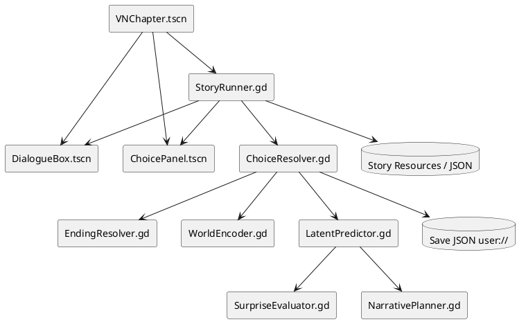
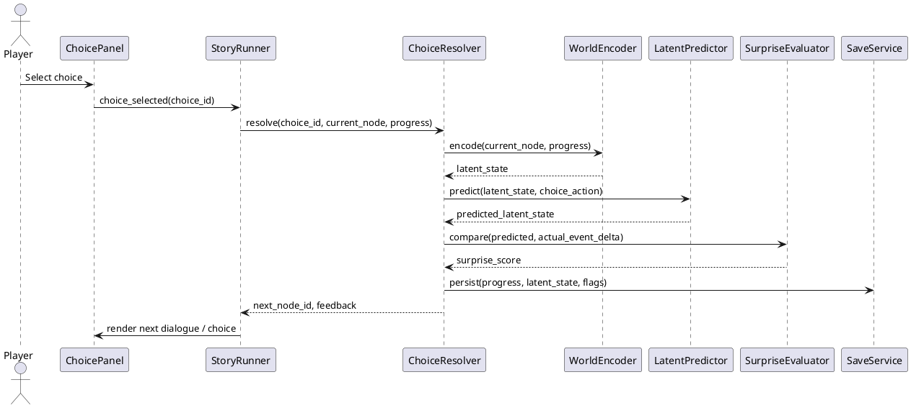

# Giac Mo Co Tich: Thach Sanh va Ly Thong

## Godot 2D Game Design and Technical Direction with LeWorldModel-inspired Architecture

> Ghi chu: Trong yeu cau co tu "LeWorkModel"; tai lieu nay hieu dung la "LeWorldModel" / "LeWM".

---

# 1. Muc tieu tai lieu

Tai lieu goc `GiacMoCoTich.docx.md` dang dinh huong Unity 2022 LTS, C#, Visual Novel / Choice-Based Adventure. Tai lieu nay chuyen huong sang Godot cho mot game 2D don gian, van giu story, tone va cau truc chapter cua ban goc, dong thoi ap dung y tuong cot loi cua LeWorldModel vao he thong narrative.

Muc tieu khong phai la dua nguyen model PyTorch LeWM vao Godot trong ban dau tien. Muc tieu thuc te hon la:

- Dung Godot 4.x lam engine chinh cho game 2D.
- Bien phan ScriptableObject cua Unity thanh custom Resource / JSON data cua Godot.
- Xay dung he thong dialogue, choice, save/load va ending theo kieu data-driven.
- Ap dung LeWorldModel o muc "LeWM-inspired": ma hoa trang thai cau chuyen thanh latent state, du doan tac dong cua choice, danh gia surprise, va lap ke hoach goi y/phan ung cua the gioi mo.
- Giu scope v1 don gian: story-first, khong combat phuc tap, khong online, khong procedural story day du.

---

# 2. Tom tat research LeWorldModel

LeWorldModel la mot Joint-Embedding Predictive Architecture (JEPA) world model. Theo trang chinh thuc va arXiv, model gom hai phan cot loi:

- Encoder: anh xa observation frame tu pixel sang latent embedding.
- Predictor: nhan latent embedding hien tai va action, sau do du doan latent embedding cua trang thai tiep theo.

Training objective gom prediction loss va SIGReg, mot regularizer ep latent embedding co phan phoi Gaussian. Diem quan trong cua LeWM la huan luyen end-to-end tu raw pixels, tranh representation collapse, va planning nhanh trong latent space. Trang chinh thuc mo ta planning bang cach encode start/goal image, sau do toi uu chuoi action bang Cross-Entropy Method de dua latent state gan goal.

Nguon tham khao chinh:

- Official project: https://le-wm.github.io/
- arXiv paper: https://arxiv.org/abs/2603.19312
- Official code: https://github.com/lucas-maes/le-wm
- Official checkpoints/data: https://huggingface.co/collections/quentinll/lewm
- Godot Autoload docs: https://docs.godotengine.org/en/stable/tutorials/scripting/singletons_autoload.html
- Godot Resource docs: https://docs.godotengine.org/en/stable/tutorials/scripting/resources.html
- Godot save/load docs: https://docs.godotengine.org/en/stable/tutorials/io/saving_games.html

Ket luan engineering: LeWM that su la mot ML system dung Python/PyTorch va datasets rieng. Voi game 2D narrative don gian, viec tich hop truc tiep model that vao Godot v1 la qua nang. Thay vao do, ta nen ap dung abstraction cua LeWM vao gameplay:

- Observation = node hien tai, scene context, emotional state, dream state.
- Action = player choice.
- Latent state = vector diem an: trust, courage, knowledge, mercy, suspicion, dream_stability, danger.
- Predictor = rule-based / lightweight numeric predictor.
- Surprise = do lech giua du doan cua model va event thuc te.
- Planner = simulate vai buoc choice de tao loi thi tham cua Rung Mong, goi y narrative, hoac dieu chinh UI feedback.

---

# 3. Phan tich luong trien khai cua yeu cau

Yeu cau cua ban co the tach thanh 5 luong:

1. Doc GDD goc.
   - Xac dinh game dang la Visual Novel / Choice-Based Adventure.
   - Story chinh la Thach Sanh & Ly Thong trong framework "Giac Mo Co Tich".
   - Scope goc gom Prologue, 5 Chapter, Epilogue, 4 endings.

2. Chuyen Unity sang Godot.
   - Unity Scene -> Godot Scene tree.
   - C# ScriptableObject -> Godot Resource `.tres` hoac JSON.
   - GameManager singleton -> Godot Autoload.
   - MonoBehaviour UI scripts -> Control scene scripts bang GDScript hoac C#.

3. Xac dinh cach ap dung LeWorldModel.
   - Khong dung real LeWM full training trong v1.
   - Dung LeWM-inspired latent narrative model de du doan tac dong choice.
   - Dua surprise/planning vao game nhu mot co che "Rung Mong thi tham".

4. Thiet ke game 2D don gian.
   - First playable nen la Prologue + Chapter 1.
   - Khong combat realtime.
   - Choice se thay doi latent state va ending score.

5. Viet tai lieu moi.
   - Tai lieu nay la ban technical direction cho Godot 2D + LeWM-inspired system.
   - Can duoc confirm them o cac cau hoi cuoi tai lieu truoc khi implement code production.

---

# 4. Trade-off cac huong ap dung LeWorldModel

| Phuong an | Scalable | Maintainable | Security | Performance | User Experience | Danh gia |
| :--- | :--- | :--- | :--- | :--- | :--- | :--- |
| A. Tich hop LeWM that bang Python/PyTorch sidecar | Cao neu sau nay can AI planning that va co dataset rieng | Thap hon vi phai quan ly Godot + Python runtime + model weights | Rui ro cao hon: IPC, model files, dependency, file input phai validate ky | Nang, kho cho mobile, startup cham, GPU/CPU phu thuoc may nguoi choi | Co the tao AI behavior doc dao nhung v1 de loi, de lag | Khong nen cho v1 |
| B. LeWM-inspired latent narrative model trong Godot | Du de mo rong chapter/ending, co the them rule/predictor moi | Cao, vi logic nam trong GDScript/Resource/JSON, de debug | Tot, local-only, khong chay code ngoai, save data de validate | Rat nhe, phu hop PC/mobile | Nguoi choi cam nhan the gioi phan ung thong minh hon ma khong bi cham | Khuyen nghi cho v1 |
| C. Khong ap dung world model, chi dung branching dialogue co dinh | Trung binh, tang branch se nhanh bi no | De maintain luc dau, kho khi story phinh to | Tot nhat vi it logic | Nhanh nhat | It bat ngo, "LeWorldModel" chi nam tren ten, khong tao khac biet gameplay | Chi nen dung lam fallback |

Quyet dinh de xuat: chon phuong an B cho v1. No giu duoc tinh than LeWM ma van phu hop scope game 2D don gian trong Godot.

---

# 5. Mapping Unity sang Godot

| Unity trong GDD goc | Godot de xuat | Ghi chu trien khai |
| :--- | :--- | :--- |
| BootScene | `res://scenes/app/AppRoot.tscn` | Scene khoi dong, load Autoload, route sang menu/chapter |
| MainMenuScene | `res://scenes/ui/MainMenu.tscn` | New Game, Continue, Gallery, Settings |
| Chapter_01_Scene -> Chapter_05_Scene | `res://scenes/chapter/VNChapter.tscn` + data chapter | Nen dung mot scene chapter generic doc data thay vi 5 scene duplicate |
| UIScene Additive | UI la child cua `VNChapter.tscn` hoac CanvasLayer | Godot khong can additive scene theo cung cach Unity |
| GameManager.cs Singleton | `GameState.gd` Autoload | Luu runtime state, current chapter, current node |
| StoryManager.cs | `StoryRunner.gd` | Dieu phoi node dialogue/choice |
| ChoiceHandler.cs | `ChoiceResolver.gd` | Apply choice effect vao PlayerProgress + LatentState |
| EndingCalculator.cs | `EndingResolver.gd` | Tinh True/Good/Bad/Secret |
| ScriptableObject StoryData | Custom `Resource` hoac JSON | De content team sua de dang |
| PlayerPrefs backup | `FileAccess` + JSON trong `user://` | Nen dung schema version de migrate save |
| EventBus.cs | Godot signals + optional `SignalBus.gd` Autoload | Signals la first-class trong Godot |

---

# 6. Kien truc Godot de xuat

## 6.1 Layer architecture

| Layer | Trach nhiem | Godot nodes/scripts/resources |
| :--- | :--- | :--- |
| Presentation Layer | UI dialogue, choices, portrait, transition, audio feedback | `DialogueBox.tscn`, `ChoicePanel.tscn`, `PortraitView.tscn`, `InkTransition.tscn`, `AudioDirector.gd` |
| Narrative Logic Layer | Chay story node, apply choice, route chapter, tinh ending | `StoryRunner.gd`, `ChoiceResolver.gd`, `EndingResolver.gd` |
| LeWM-inspired World Model Layer | Encode narrative observation, predict next latent, tinh surprise, simulate choice path | `WorldEncoder.gd`, `ActionEncoder.gd`, `LatentPredictor.gd`, `SurpriseEvaluator.gd`, `NarrativePlanner.gd` |
| Data Layer | Story, character, choice, chapter, rule set, save data | `StoryChapterResource.gd`, `DialogueNodeResource.gd`, `ChoiceResource.gd`, `CharacterResource.gd`, JSON save |
| Infrastructure Layer | Scene flow, save/load, settings, signal bus | `SceneFlow.gd`, `SaveService.gd`, `SettingsService.gd`, `SignalBus.gd` |

## 6.2 PlantUML component diagram



---

# 7. LeWM-inspired narrative model

## 7.1 Core concept

Trong game goc, choice dang tac dong truc tiep den ending score. Ban Godot nen them mot lop latent state o giua:

```text
Story Node + Player Progress + Scene Context
        -> WorldEncoder
        -> LatentState
Player Choice
        -> ActionEncoder
LatentState + Action
        -> LatentPredictor
        -> PredictedLatentState
PredictedLatentState + ActualStoryEvent
        -> SurpriseEvaluator
        -> UI feedback / Rung Mong whisper / Ending score adjustment
```

## 7.2 LatentState de xuat

| Field | Range | Y nghia narrative |
| :--- | :--- | :--- |
| `trust` | -100..100 | Muc do Thach Sanh tin nguoi khac |
| `courage` | 0..100 | Muc do san sang doi mat nguy hiem |
| `knowledge` | 0..100 | Muc do biet ve than phan, lore, Long Cung |
| `mercy` | 0..100 | Kha nang tha thu, giai quyet bang nhan tinh |
| `suspicion` | 0..100 | Muc nghi ngo Ly Thong va cac event bat thuong |
| `dream_stability` | 0..100 | Do on dinh cua Rung Mong / giac mo |
| `danger` | 0..100 | Ap luc nguy hiem cua chapter hien tai |

## 7.3 Action vector cho choice

Moi choice khong chi co `next_node_id`, ma nen co `action_tags` va `latent_delta`.

Vi du:

```json
{
  "choice_id": "ch2_listen_chan_tinh",
  "text": "Lang nghe truoc khi chien dau",
  "next_node_id": "ch2_memory_fragment",
  "action_tags": ["listen", "mercy", "knowledge"],
  "latent_delta": {
    "knowledge": 18,
    "mercy": 10,
    "danger": 6,
    "dream_stability": -4
  },
  "ending_flags": ["heard_chan_tinh"]
}
```

## 7.4 Predictor

Ban v1 nen dung predictor rule-based:

- Input: `LatentState current`, `ChoiceAction action`, `ChapterContext context`.
- Output: `LatentState predicted`.
- Rule weight duoc luu trong `LeWMRuleSetResource`.
- Co clamp range de tranh state vuot nguong.
- Co deterministic seed neu can replay/debug.

Khong nen training ML trong v1. Neu sau nay can ML that, predictor co the duoc thay bang:

- Python sidecar local service.
- ONNX runtime neu model duoc export nhe.
- Remote inference service cho internal tooling, khong nen dung cho gameplay offline ban dau.

## 7.5 Surprise score

Surprise la do lech giua dieu game "du doan" va event thuc te. Trong narrative, surprise khong phai loi, ma la co che tao cam giac giac mo bat on.

Cong thuc don gian:

```text
surprise = weighted_distance(predicted_latent, actual_latent_after_story_event)
```

Ung dung:

- Surprise thap: UI feedback em, Rung Mong on dinh.
- Surprise trung binh: co tieng thi tham, particle/screen tint nhe.
- Surprise cao: node dac biet, glitch dream, clue ve Secret Ending.

## 7.6 Planner

Planner khong nen dieu khien story thay nguoi choi. No chi nen simulate 2-3 buoc de:

- Chon cau "Rung Mong thi tham" phu hop.
- Dieu chinh intensity cua hint.
- Cho NPC phan ung hop ly voi lich su choice.
- Hien thi feedback tinh te khi choice co trong luong.

Gioi han khuyen nghi:

- Horizon: 2 hoac 3 choice nodes.
- Candidate paths: 8-16.
- Run only khi choice panel hien ra, khong run moi frame.
- Cache theo `(chapter_id, node_id, latent_state_bucket)`.

---

# 8. Data design trong Godot

## 8.1 Folder structure de xuat

```text
res://
  scenes/
    app/
      AppRoot.tscn
    chapter/
      VNChapter.tscn
    ui/
      DialogueBox.tscn
      ChoicePanel.tscn
      MainMenu.tscn
      SettingsMenu.tscn
    effects/
      InkTransition.tscn
  scripts/
    autoload/
      GameState.gd
      SceneFlow.gd
      SaveService.gd
      SignalBus.gd
    narrative/
      StoryRunner.gd
      ChoiceResolver.gd
      EndingResolver.gd
    world_model/
      WorldEncoder.gd
      ActionEncoder.gd
      LatentState.gd
      LatentPredictor.gd
      SurpriseEvaluator.gd
      NarrativePlanner.gd
    resources/
      StoryChapterResource.gd
      DialogueNodeResource.gd
      ChoiceResource.gd
      CharacterResource.gd
      LeWMRuleSetResource.gd
  data/
    story/
      prologue.json
      chapter_01.json
    characters/
      thach_sanh.tres
      ly_thong.tres
    world_model/
      lewm_rules_v1.tres
  assets/
    art/
    audio/
    fonts/
```

## 8.2 Story node schema

```json
{
  "node_id": "ch1_forest_warning",
  "type": "dialogue",
  "speaker": "Rung Mong",
  "text": "Dem nay, co nguoi mang loi ngot ngao den gan goc da.",
  "portrait": null,
  "background": "forest_night",
  "next_node_id": "ch1_ly_thong_arrives",
  "latent_event": {
    "suspicion": 8,
    "dream_stability": -3
  }
}
```

## 8.3 Choice node schema

```json
{
  "node_id": "ch1_accept_brotherhood_choice",
  "type": "choice",
  "prompt": "Ly Thong muon ket nghia anh em.",
  "choices": [
    {
      "choice_id": "agree_fast",
      "text": "Duoc thoi, co nguoi bau ban cung vui.",
      "next_node_id": "ch1_agree_fast_result",
      "latent_delta": {
        "trust": 15,
        "suspicion": -5
      },
      "ending_flags": ["trusted_ly_thong_early"]
    },
    {
      "choice_id": "hesitate",
      "text": "De tao nghi da. Rung vua nhac tao can than voi nguoi la.",
      "next_node_id": "ch1_hesitate_result",
      "latent_delta": {
        "trust": 4,
        "suspicion": 10,
        "knowledge": 4
      },
      "ending_flags": ["revealed_forest_whisper"]
    }
  ]
}
```

---

# 9. Runtime flow

## 9.1 Sequence khi nguoi choi chon mot choice



## 9.2 Chapter flow

1. `AppRoot.tscn` load `GameState` va `SaveService`.
2. Player chon New Game / Continue.
3. `SceneFlow` mo `VNChapter.tscn`.
4. `StoryRunner` load `StoryChapterResource` hoac JSON chapter.
5. Dialogue node hien text, portrait, background, BGM.
6. Choice node hien options.
7. Choice duoc resolve qua LeWM-inspired layer.
8. Save progress sau moi choice quan trong.
9. Cuoi chapter, `EndingResolver` update ending route.
10. End game route sang True/Good/Bad/Secret ending.

---

# 10. MVP de xuat

## 10.1 First playable

Nen lam ban dau voi scope:

- Prologue: phong ngu, bo/me ke chuyen, fade vao Rung Mong.
- Chapter 1: Goc Da & Tieng Thi Tham.
- 1 background ngay, 1 background dem.
- 2 character portraits: Thach Sanh, Ly Thong.
- 1 choice node co 3 choices.
- LatentState duoc hien trong debug overlay, khong hien cho player.
- Rung Mong whisper thay doi theo surprise score.
- Save/load current node va latent state.

## 10.2 Definition of Done cho MVP

- Player co the vao game tu main menu.
- Dialogue typewriter chay on dinh.
- Choice thay doi next node dung.
- LatentState thay doi dung theo choice.
- Surprise score duoc tinh va log/debug duoc.
- Save/load khoi phuc dung chapter, node, flags, latent state.
- Co it nhat 1 branch tao feedback "Rung Mong thi tham".

---

# 11. Ke hoach trien khai 8 tuan bang Godot

| Tuan | Muc tieu | Cong viec | Deliverable |
| :--- | :--- | :--- | :--- |
| 1 | Godot foundation | Tao folder structure, Autoloads, AppRoot, MainMenu, SceneFlow | Project chay vao menu |
| 2 | Data-driven story | Tao JSON/Resource schema, StoryRunner load Prologue/Chapter 1 | Dialogue node render duoc |
| 3 | Dialogue UI | Typewriter, portrait, background, transition, input next | VN loop co ban |
| 4 | Choice system | ChoicePanel, ChoiceResolver, flags, next node branching | Chapter 1 co choice playable |
| 5 | LeWM-inspired layer | LatentState, WorldEncoder, LatentPredictor, SurpriseEvaluator | Choice thay doi latent + surprise |
| 6 | Planner + whisper | NarrativePlanner simulate 2 buoc, Rung Mong hint feedback | The gioi mo phan ung theo state |
| 7 | Save/load + polish | SaveService JSON, settings, audio, ink transition | MVP on dinh |
| 8 | QA + build | Test branch, test save, test PC/mobile viewport, bugfix | First playable release |

---

# 12. Security, performance va UX guardrails

## 12.1 Security

- Save files o `user://`, khong doc path tu input nguoi choi.
- JSON load phai validate `schema_version`, `chapter_id`, `node_id`, va field type.
- Khong deserialize object tuy y tu file save.
- Neu sau nay co Python sidecar, chi cho phep local loopback, fixed port, signed model files, timeout bat buoc.
- Khong dua API key hoac remote AI service vao client build.

## 12.2 Performance

- Khong tinh planner moi frame.
- Cache result theo node va latent bucket.
- LatentState chi la numeric dictionary nho.
- Background/portrait preload theo chapter, khong load toan game.
- Mobile target can kiem tra font, texture size, audio compression.

## 12.3 User experience

- LeWM-inspired logic khong duoc lam nguoi choi cam thay bi mat quyen quyet dinh.
- Surprise feedback phai tinh te: am thanh, text whisper, particle, tint nhe.
- Debug latent state chi hien trong dev mode.
- Choice text phai ro tac dong ve cam xuc, khong can lo diem so.
- Khong hien UI nhu HP/stat panel vi ban goc la story-first.

---

# 13. Cau hoi can ban xac nhan

1. Ban muon dung GDScript hay C# trong Godot?
   - De xuat: GDScript cho v1 vi nhanh, gan voi Godot, it boilerplate.

2. "Applied LeWorldModel" cua ban co bat buoc phai chay model LeWM/PyTorch that khong, hay chap nhan LeWM-inspired latent predictor nhu tai lieu nay?
   - De xuat: LeWM-inspired cho v1, real LeWM de nghien cuu sau.

3. MVP dau tien can full 5 chapter hay chi Prologue + Chapter 1?
   - De xuat: Prologue + Chapter 1 de co vertical slice chac.

4. Platform uu tien la PC Windows hay mobile?
   - De xuat: PC Windows truoc, mobile sau khi UI/asset on dinh.

5. Tai lieu va content story nen giu tieng Viet 100%, hay can song ngu Viet/Anh?
   - De xuat: tieng Viet cho story, code identifiers bang English.

6. Ban muon game co movement 2D side-view that su, hay chi background 2D + portrait + choice nhu visual novel?
   - De xuat: visual novel 2D truoc, movement de v2.

---

# 14. Ket luan

Ban Godot phu hop nhat nen la mot visual novel 2D data-driven, co mot lop LeWM-inspired narrative model de lam story branch thong minh hon. Cach nay giu duoc tinh than LeWorldModel: encode state, predict next state, evaluate surprise, plan trong latent space. Dong thoi no van phu hop quy mo game co tich 2D, de maintain, de debug, va co the build duoc thanh MVP trong thoi gian ngan.

Sau khi cac cau hoi o muc 13 duoc confirm, buoc tiep theo nen la implement vertical slice:

- Godot AppRoot + MainMenu.
- DialogueBox + ChoicePanel.
- Prologue + Chapter 1 JSON.
- LatentState + LatentPredictor rule-based.
- Save/load JSON.
