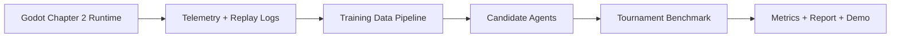
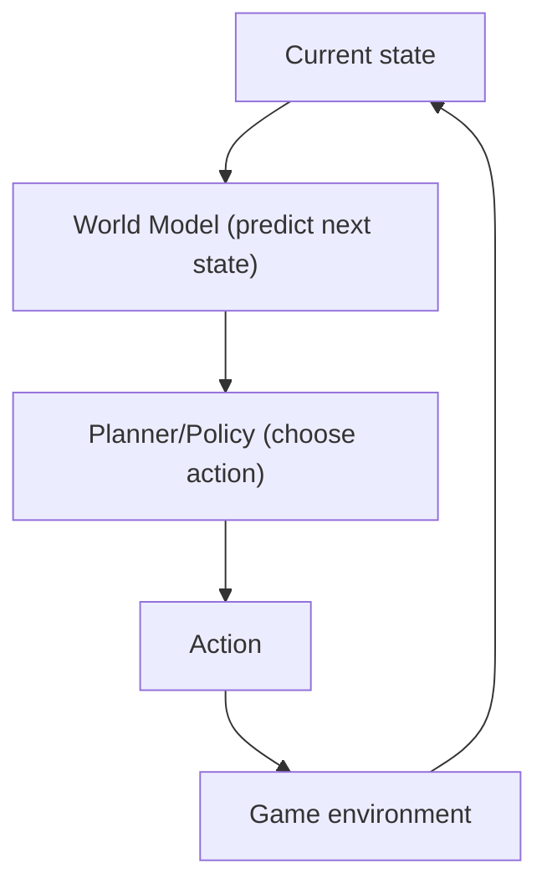
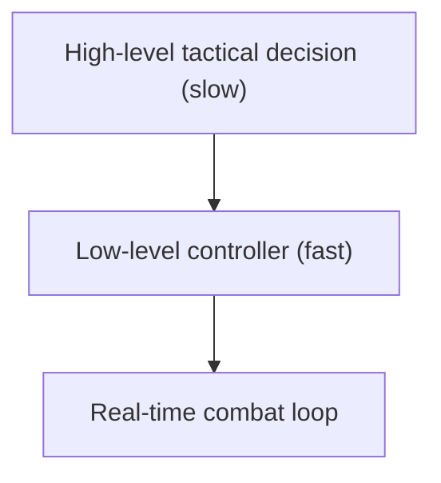
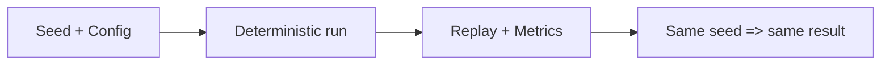
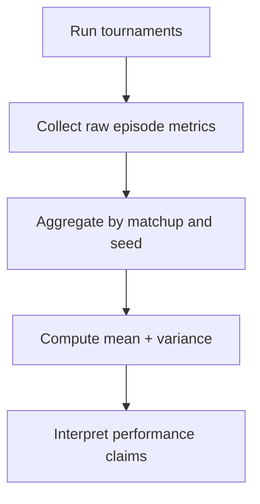
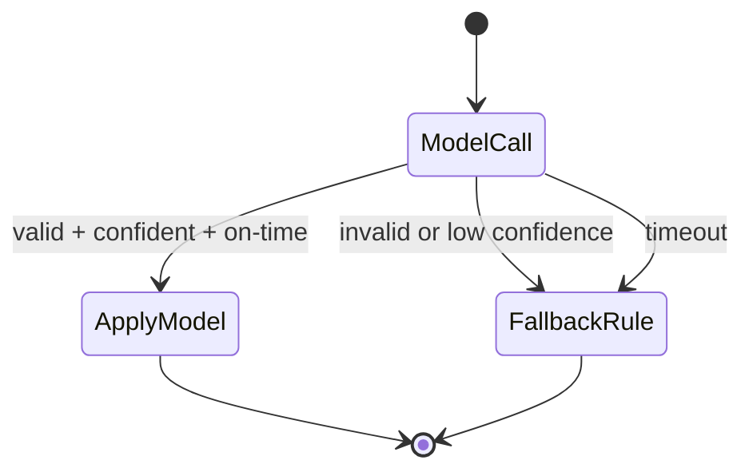

# AI Foundations Guide for the Chapter 2 Plan

> Mermaid diagrams are written for **Mermaid v11.14.0**.
> This document is a learning-first companion to the implementation plan.

## 1. Why this document exists

You asked for a practical AI plan, but that plan assumes concepts from:

- game AI architecture,
- world models,
- supervised learning and RL baselines,
- LLM integration patterns,
- benchmarking and evaluation.

This guide explains those concepts in plain engineering language, connected directly to this project.

## 2. Big picture: what you are building

For Chapter 2, you are not building "one magic AI."  
You are building an **AI experiment system** with multiple agents that can be compared fairly.

## 3. Core architecture concepts

## 3.1 World Model vs Policy

This is the most important distinction.

- **World Model**: predicts "what may happen next" from current state and action.
- **Policy**: decides "what action to do now."

LeWM-style ideas are mostly on the **world-model side**.  
To act in game, you still need a planner or policy.

## 3.2 Layered AI in real-time games

Use layers instead of a single model:

- **High-level layer**: choose tactic every 2-3 seconds.
- **Low-level layer**: movement, aiming, attacks each frame.

This is why "LLM as tactical boss" is feasible, while "LLM controls every frame" is usually too slow.

## 4. What "LeWorldModel-inspired" means in this project

In your current codebase, LeWM is implemented as:

- observation windows from gameplay,
- state updates (`WorldState`),
- reaction logic (`LeWMReactionSystem`),
- visible effects (boss tactic, pressure, warnings).

So the project already has a **world-reaction abstraction**.  
Training adds a learned predictor to this abstraction, not a full paper reproduction.

## 5. Data and telemetry fundamentals

Models are only as good as logs.  
For Chapter 2, the core dataset unit is a time window (for example 3 seconds).

Typical features:

- attack frequency,
- bow usage ratio,
- aim accuracy,
- distance to boss,
- weapon-switch frequency,
- dash frequency,
- preparation flags (`clue_read`, `trap_cleared`).

Typical labels/targets:

- tactic class (`PunishSpam`, `CloseGap`, ...),
- pressure value,
- severity value.

## 5.1 Why deterministic replay matters

If runs are not reproducible, your benchmark is not trustworthy.

Use:

- fixed random seeds,
- fixed simulation settings,
- replay logs.

## 6. Candidate bots and why they are needed

To claim "LeWM is better," you need baselines.

1. **Rule/FSM bot**
   - strongest baseline for engineering stability.
2. **Utility AI / Behavior Tree bot**
   - stronger handcrafted adaptive baseline.
3. **RL bot (PPO-lite)**
   - learning baseline from reward optimization.
4. **LeWM-based player agent**
   - world-model-informed planning.
5. **LLM-hybrid boss**
   - high-level tactical reasoning layer.

Without baselines, a "smart" demo is just subjective.

## 7. LLM role in this project (important boundary)

Do **not** use LLM for per-frame control.  
Use LLM for:

- tactical intent classification,
- strategy switching,
- explanation text (optional).

Keep a strict interface:

- input: compact state summary,
- output: one tactic + confidence + optional rationale.

Then let deterministic low-level code execute that tactic.

## 8. Training concepts you need

## 8.1 Supervised learning (first step)

Train from recorded `(features -> target)` data:

- classification for tactic,
- regression for pressure/severity.

Benefits:

- simple and fast to start,
- easy to debug.

Limit:

- model learns from labels quality; bad labels produce bad behavior.

## 8.2 Reinforcement learning (baseline, not first)

Train by reward:

- win fight,
- survive longer,
- avoid damage.

Benefits:

- can discover unexpected behavior.

Costs:

- unstable training,
- sensitive to reward shaping,
- needs many episodes.

## 8.3 Overfitting and generalization

If a model only wins on training maps or fixed scripts, it is not truly smarter.

Prevent this with:

- train/validation/test split by episode,
- unseen seeds and behavior patterns,
- cross-map tests if possible.

## 9. Benchmarking fundamentals

## 9.1 Core metrics

- **Win Rate**: `% of wins over N episodes`.
- **Time-to-Kill (TTK)**: average time to defeat opponent.
- **Damage Taken**: average incoming damage.
- **Adaptation Score**: performance after opponent changes style.
- **Latency**: inference delay (must stay under gameplay budget).

## 9.2 Statistical discipline

Use enough episodes and multiple seeds.

Recommended minimum for showcase credibility:

- 100+ episodes per matchup,
- 3-5 seed groups,
- report mean and variance (or confidence interval).

## 10. Safety and fallback engineering

A model can fail. Demo must not crash.

Always include fallback:

- invalid output -> rule-based control,
- low confidence -> rule-based control,
- high latency timeout -> rule-based control.

## 11. How this maps to your plan

## 11.1 Dependency order

You cannot jump to "smart AI battle" first.  
Correct dependency chain:

1. deterministic simulator + telemetry,
2. baseline agents,
3. LeWM training/integration,
4. LLM tactical layer,
5. benchmark tournament and report.

## 11.2 Why this order is optimal

- It de-risks the project early.
- It gives you measurable progress each month.
- It ensures final claims are evidence-based, not impression-based.

## 12. Practical glossary (quick reference)

- **Observation window**: a short time slice of gameplay features.
- **Feature vector**: numeric representation of game behavior in that window.
- **Label**: target output used for supervised training.
- **Policy**: mapping from state to action.
- **World model**: predictor of future state.
- **Inference**: running a trained model to get outputs.
- **Latency budget**: max allowed decision time before gameplay quality drops.
- **Baseline**: reference method for fair comparison.
- **Ablation**: remove one component to measure its contribution.

## 13. Minimum knowledge checklist before coding

You are ready to implement when you can explain:

1. Difference between world model and policy.
2. Why high-level LLM + low-level deterministic control is used.
3. Why deterministic replay and seeds are required for benchmarks.
4. How supervised targets for Chapter 2 are defined.
5. What fallback conditions force rule-based behavior.
6. Which metric supports which claim ("smarter", "faster", "more adaptive").

## 14. Suggested study sequence (compact)

1. Game AI architecture basics (FSM, BT, Utility AI).
2. Supervised learning for classification/regression.
3. RL basics (PPO conceptually, not deep theory first).
4. World-model intuition (latent prediction and planning).
5. Benchmark design and statistical reporting.

If you learn in this order, the implementation plan will become straightforward and less risky.
