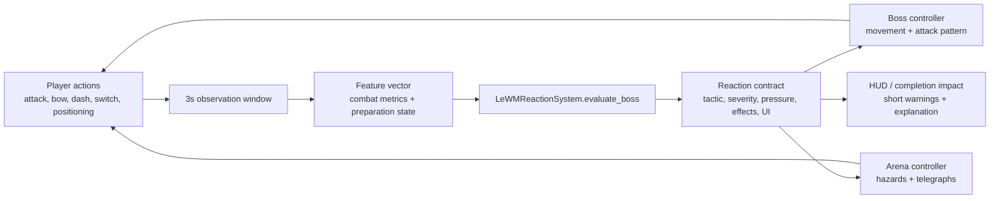
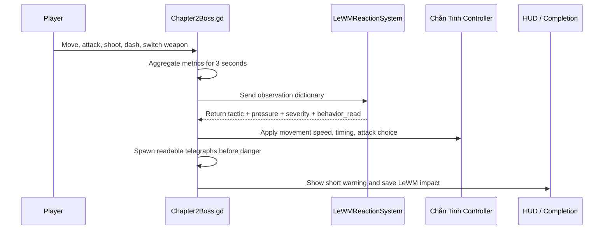
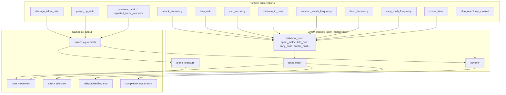
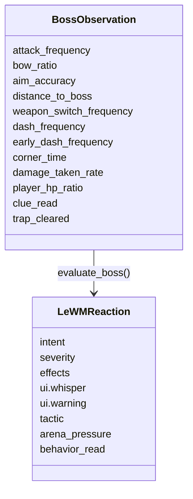
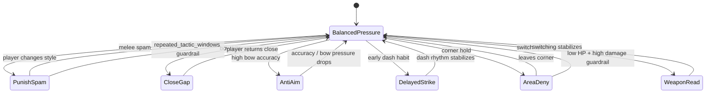
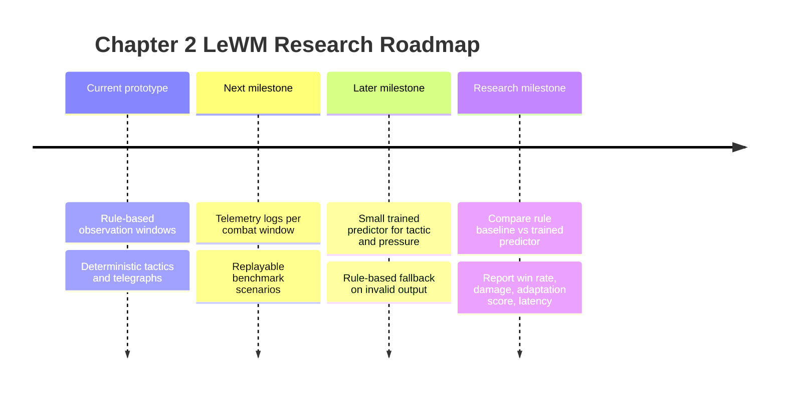

# Chapter 2 LeWorldModel Applied Runtime Explainer

> Mermaid diagrams target **Mermaid.js v11.15.0**, verified from the official GitHub release page on 2026-05-19. The diagrams use stable Mermaid diagram types so they remain readable in common Markdown renderers.

## Purpose

Chapter 2 applies a **LeWorldModel-inspired runtime loop** to make the Chằn Tinh boss feel as if it is reading the player and adapting the fight. This is not the full neural LeWorldModel paper stack. In this project, LeWM is applied as a lightweight, deterministic world-reaction layer inside Godot:

- observe short windows of player behavior,
- encode the behavior into compact gameplay metrics,
- predict a boss reaction intent,
- apply that intent as movement, attack timing, telegraphs, arena pressure, and end-of-stage explanation.

The result is a boss that reacts to *how* the player fights, not only to HP phases.

## Runtime Loop

The important design choice is that LeWM does **not** control the boss every frame. It chooses a high-level reaction every few seconds. The normal Godot combat controller still handles movement, projectile updates, telegraph countdowns, collision, and damage.

## What Was Applied In Game

Current runtime reactions:

| Reaction | What LeWM reads | Game effect | Player-facing meaning |
|---|---|---|---|
| `PunishSpam` | Repeated axe attacks | Counter ring telegraph | The boss learned the melee rhythm. |
| `CloseGap` | Bow kiting from long distance | Faster boss chase | Safe distance starts shrinking. |
| `AntiAim` | Accurate bow hits | Zigzag movement | The boss avoids predictable aim lines. |
| `DelayedStrike` | Early dash / dash spam near boss pressure | Delayed hit telegraph | Dodging too early becomes risky. |
| `AreaDeny` | Holding a corner or safe zone too long | Hazard telegraph near the player | The arena rejects passive camping. |
| `WeaponRead` | Too many weapon switches | Increased timing pressure | The boss reads indecisive switching. |
| `BalancedPressure` | No dominant pattern | Baseline projectiles and chase | Combat remains stable. |

## Metrics And Their Meaning

### Runtime metrics

| Metric | How it is interpreted in game | Research meaning |
|---|---|---|
| `attack_frequency` | Detects repeated melee aggression. High values can trigger `PunishSpam`. | A compact action-rate feature; similar to behavior-window encoding in player modeling. |
| `bow_ratio` | Measures whether the player relies on bow attacks. High bow use plus long distance can trigger `CloseGap`. | A style-distribution feature that separates melee and ranged policies. |
| `aim_accuracy` | Bow hits divided by bow shots. High accuracy can trigger `AntiAim`. | A task-performance feature that lets the model react to skill, not just input frequency. |
| `distance_to_boss` | Distinguishes close combat from kiting. | A spatial state feature; useful for predicting future interaction risk. |
| `weapon_switch_frequency` | Detects noisy or excessive switching. | A policy-instability signal; helps identify indecision or exploit attempts. |
| `dash_frequency` | Detects repeated dodge usage. | A defensive-action rate feature. |
| `early_dash_frequency` | Detects dashes before the boss has actually committed to danger. Can trigger `DelayedStrike`. | A timing feature; closer to sequence behavior than a simple count. |
| `corner_time` | Tracks how long the player stays near arena corners. Can trigger `AreaDeny`. | A positional habit feature; identifies safe-zone exploitation. |
| `damage_taken_rate` | Measures recent pressure on the player. | A safety and balancing signal, used to avoid unfair escalation. |
| `player_hp_ratio` | Reduces pressure when the player is low HP and recently damaged. | A guardrail feature; prevents the adaptive system from becoming a pure difficulty amplifier. |
| `clue_read` | Reduces early reaction severity if the player prepared. | A cross-system context feature; narrative preparation changes combat interpretation. |
| `trap_cleared` | Slightly reduces severity and records trap awareness. | A preparation / environment-awareness feature. |
| `previous_tactic` | Tracks the last LeWM tactic. | Short memory for reaction continuity. |
| `repeated_tactic_windows` | Reduces pressure when the same strong tactic repeats too long. | A stability guardrail; prevents mode collapse into one overused reaction. |

## Reaction Contract

Every boss evaluation returns a standardized reaction object:

`intent` and `tactic` are usually the same for Chapter 2. `severity` says how strong the reading is. `arena_pressure` changes boss speed and attack pressure. `effects` are readable gameplay markers, such as `counter_ring`, `zigzag`, `delayed_hit`, or `corner_read`. `behavior_read` is saved so the completion screen can explain what the boss recognized.

## Fairness Guardrails

The system should feel intelligent, not punitive. For that reason:

- dangerous effects are telegraphed before they deal damage,
- repeated strong tactics get softened,
- high recent player damage can reduce pressure,
- preparation reduces severity,
- LeWM reactions explain themselves through short prompts and the completion screen.

## Research Interpretation

The implementation maps LeWorldModel ideas into a practical game prototype:

| LeWorldModel idea | Chapter 2 implementation |
|---|---|
| Encode current state | Convert player behavior into a compact observation dictionary. |
| Predict future / next latent state | Select a likely boss reaction from the observed play style. |
| Plan in latent space | Choose a high-level tactic instead of frame-by-frame actions. |
| Apply action to environment | Change boss speed, movement style, attack timing, hazards, and warnings. |
| Evaluate surprise / adaptation | Track danger spikes, behavior reads, and LeWM impact after the fight. |

In research terms, this is a **symbolic latent world model** rather than a neural pixel model. It is useful because it creates clear, testable contracts:

- features are inspectable,
- outputs are deterministic,
- fallback behavior is always available,
- every reaction can be tied to an observed player habit.

This makes the chapter a good foundation for future work. A trained predictor can later replace or assist `evaluate_boss()`, while the runtime interface can stay the same.

## Future Research Path

Recommended next research step:

1. Log each 3-second observation window and the selected reaction.
2. Add deterministic replay seeds for Chapter 2.
3. Train a small supervised predictor for `tactic`, `arena_pressure`, and `severity`.
4. Keep the current rule system as fallback.
5. Compare the trained predictor against the current rule baseline with repeatable combat scenarios.

## Success Criteria

The LeWM application is successful when:

- players can feel the boss reacting to their habits,
- every dangerous reaction has a readable warning,
- preparation choices affect reaction severity,
- completion output explains what the boss read,
- the system remains deterministic and debuggable,
- the same interface can later support a trained model.

## References

- Mermaid.js releases: <https://github.com/mermaid-js/mermaid/releases>
- Mermaid.js repository: <https://github.com/mermaid-js/mermaid>
- Project implementation files: `scripts/shared/LeWMReactionSystem.gd`, `scripts/chapters/Chapter2Boss.gd`, `scripts/GameRoot.gd`
