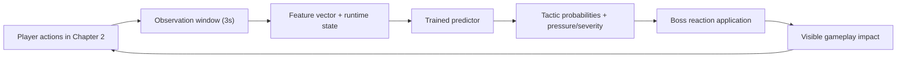
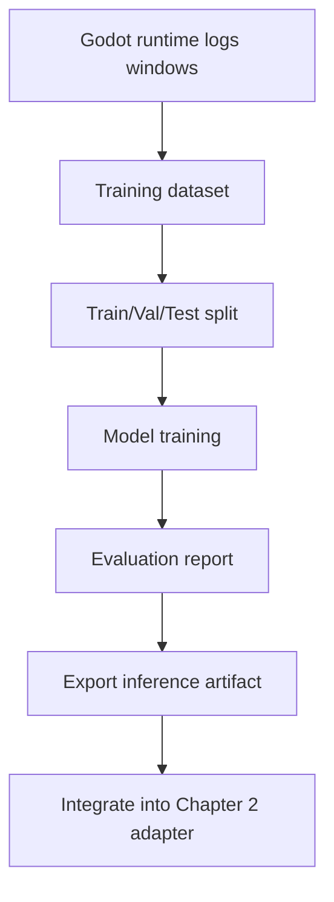
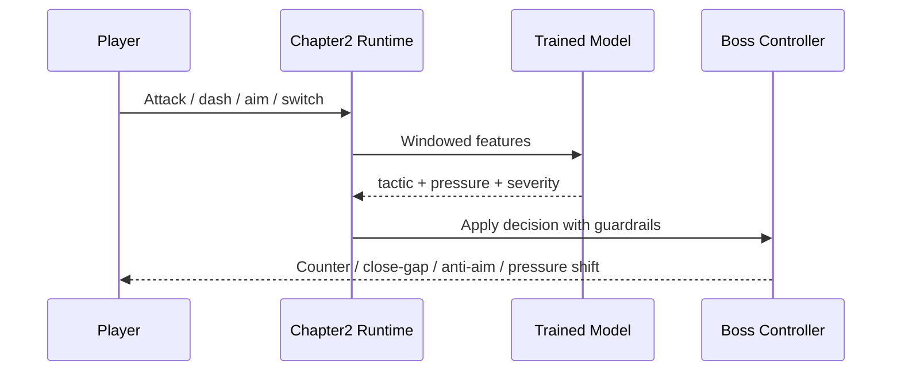

# Chapter 2 LeWorldModel-Inspired Training Approach

> Mermaid diagrams are authored for Mermaid **v11.14.0**.

## 1. What this approach is

This project uses a **LeWorldModel-inspired** method for Chapter 2, not the full original LeWorldModel training stack from the paper.

In this context, the idea is:
- Observe player behavior in short combat windows.
- Map that behavior to a compact latent decision.
- Predict boss reaction style and pressure level.
- Apply reaction back into gameplay.

So, the model is used as a **behavior predictor for boss adaptation**, not as a full pixel-level world simulator.

## 2. Why this is a good fit for Chapter 2

Chapter 2 already has:
- clear behavior signals (spam melee, kite bow, high aim accuracy, weapon switching, dash rhythm),
- clear reaction targets (`PunishSpam`, `CloseGap`, `AntiAim`, `WeaponRead`, `BalancedPressure`),
- repeated decision windows (every few seconds), which are suitable for supervised sequence learning.

## 3. How it works (high-level)

### 3.1 Data loop

### 3.2 Runtime loop

## 4. Trade-offs

| Option | What it means | Benefits | Costs / Risks | Recommendation |
|---|---|---|---|---|
| Rule-only (current) | Keep all thresholds hand-written | Stable, fast, easy to debug | Predictable over time, less adaptive | Keep as fallback baseline |
| LeWM-inspired trained predictor | Train small model on chapter behavior windows | More adaptive, stronger demo value, still lightweight | Needs data pipeline, tuning, fallback engineering | **Best next step for this project** |
| Full LeWorldModel integration | Reproduce larger JEPA pipeline with image-heavy world modeling | Closest to research form | Very high complexity and infra cost for this scope | Not recommended for current milestone |

## 5. Practical boundaries

To keep the prototype reliable:
- Use a small model and short feature windows.
- Keep deterministic fallback to current rule logic.
- Do not block gameplay on model availability.
- Keep all training/inference local (no remote dependency).

## 6. What counts as success

This approach is successful when:
1. Boss reactions differ meaningfully across player styles.
2. The game remains stable even when model output is missing/invalid.
3. Chapter 2 still feels readable and fair.
4. You can explain the pipeline clearly: observation -> prediction -> reaction.

