# Chapter 2 LeWM Training Guide

Tài liệu này hướng dẫn train LeWorldModel thật cho Chapter 2 trước. Chapter 2 là mục tiêu ưu tiên vì action schema hiện đang khớp tốt nhất giữa recorder, training dataset và runtime sidecar.

## Training Flow

```mermaid
flowchart LR
    A["Setup Python venv"] --> B["Record Chapter 2 rollouts"]
    B --> C["ml_data/lewm_raw/chapter_2/episodes"]
    C --> D["Train JEPA-style LeWM"]
    D --> E["models/lewm/chapter2/checkpoints/best.pt"]
    E --> F["Start localhost sidecar"]
    F --> G["Godot LeWMClient"]
    G --> H["LeWMOrchestrator guardrail"]
    H --> I["ML reaction or rule fallback"]
```



## Current Scope

Train Chapter 2 first.

Chapter 2 records the most complete action dictionary:

- `move_x`
- `move_y`
- `attack`
- `dash`
- `weapon_id`
- `boss_action_id`

These fields map directly to the 6-dimensional vector in `research/lewm/lewm/datasets.py`, so this chapter is the safest first target for real training.

## Prerequisites

Install Python 3.10 or 3.11. On Windows, enable "Add Python to PATH" if possible.

From the project root:

```powershell
py -3.10 -m venv .venv
.\.venv\Scripts\python -m pip install --upgrade pip
.\.venv\Scripts\python -m pip install -r .\ml_sidecar\requirements.txt
```

If `py -3.10` is unavailable, use the absolute path to your Python executable.

## Record Chapter 2 Data

Run Godot with raw LeWM recording enabled:

```powershell
D:\Godot\godot.exe --path . -- --lewm-record --lewm-image-size=128 --lewm-capture-interval=0.10
```

Enter Chapter 2 and play multiple short episodes with varied behavior:

- Spam axe at close range.
- Kite with bow from long range.
- Land accurate bow shots.
- Switch weapons frequently.
- Dash early before telegraphs.
- Hold arena corners.
- Play balanced without obvious habits.
- Include both successful and failed runs.

Target data volume:

| Stage | Episodes | Transitions | Purpose |
|---|---:|---:|---|
| Smoke train | 3-5 | 1k-3k | Verify pipeline works |
| First useful model | 30-50 | 10k-20k | Initial behavior learning |
| Better model | 80+ | 30k+ | More stable reactions |

## Validate Dataset

Check that episodes and transition rows exist:

```powershell
Get-ChildItem .\ml_data\lewm_raw\chapter_2\episodes -Directory | Measure-Object
Get-ChildItem .\ml_data\lewm_raw\chapter_2\episodes -Recurse -Filter actions.jsonl | Get-Content | Measure-Object -Line
```

Expected layout:

```text
ml_data/lewm_raw/chapter_2/
  episodes/
    ep_<timestamp>_<ticks>/
      frames/
        000000.png
        000001.png
      actions.jsonl
      metadata.jsonl
      episode.json
```

Each `actions.jsonl` row should include `frame`, `next_frame`, and `action`.

## Train

Run:

```powershell
powershell -ExecutionPolicy Bypass -File .\tools\train_lewm_chapter.ps1 -Chapter chapter_2
```

Outputs:

```text
models/lewm/chapter2/checkpoints/latest.pt
models/lewm/chapter2/checkpoints/best.pt
models/lewm/chapter2/training_metrics.json
```

Watch the printed JSON rows. `val_loss` should generally trend down. Small fluctuations are normal.

## Evaluate

```powershell
$env:PYTHONPATH="$PWD\research\lewm"
.\.venv\Scripts\python .\research\lewm\scripts\evaluate.py --config .\research\lewm\configs\train_lewm_chapter2.yaml --checkpoint .\models\lewm\chapter2\checkpoints\best.pt
```

Check:

- `samples` is the expected transition count.
- `prediction_loss` is not `NaN`.
- `latent_variance_mean` is not near zero.
- `latent_variance_min` is not collapsed across most dimensions.

## Run The Trained Model

Start the local sidecar with the trained checkpoint:

```powershell
powershell -ExecutionPolicy Bypass -File .\tools\start_lewm_sidecar.ps1 -Checkpoint .\models\lewm\chapter2\checkpoints\best.pt
```

Health check:

```powershell
Invoke-RestMethod http://127.0.0.1:8765/health
```

Expected:

```text
model_loaded = true
model_version contains best.pt
```

Run Godot normally, without `--lewm-no-ml`. In-game, press `F9` and verify:

```text
lewm_source:ml
model:lewm-local:best.pt
```

If it shows `fallback`, the sidecar is offline, the checkpoint did not load, or the ML output was rejected by the guardrail.

## Security Checklist

| Area | Requirement | Reason |
|---|---|---|
| Raw data | Do not commit `ml_data/` | Captures may contain gameplay telemetry and large image data |
| Checkpoints | Do not commit `models/lewm/` or `*.pt` | Model artifacts are large and local-runtime only |
| Sidecar binding | Keep sidecar on `127.0.0.1` | Prevents LAN exposure of prediction API |
| Runtime output | Keep `LeWMOrchestrator` sanitization enabled | ML can only select known safe reaction intents |
| Fallback | Keep rule fallback enabled | Game stays playable if ML fails |
| Secrets | Do not add tokens or private paths to config | Prevents accidental credential leakage |

The repository `.gitignore` already excludes `ml_data/`, `models/lewm/`, `*.pt`, `*.pth`, and `*.ckpt`. Do not override this for normal training.

## Trade-Offs

| Approach | Scalable | Maintainable | Security | Performance | User Experience |
|---|---|---|---|---|---|
| Train Chapter 2 first | Good, focused first model | Easiest to debug | Local-only | Small model, fast iteration | Boss reactions become more adaptive |
| Train all chapters now | Broad but premature | Schema mismatch risk | Local-only | More data and train time | Reactions may feel inconsistent |
| Keep sidecar + fallback | Good production shape | Clear separation | Guardrail blocks unsafe output | Extra localhost call | Game does not break when ML fails |
| Commit data/checkpoints | Poor for repo growth | Hard to review | Risky telemetry/artifact leak | Bloats clone/push | No gameplay benefit |

## Troubleshooting

### Python is not found

Install Python and use:

```powershell
py -3.10 --version
```

If Python is installed outside PATH, pass its absolute path to the scripts or create `.venv` manually.

### No transitions found

The training script expects:

```text
ml_data/lewm_raw/chapter_2/episodes
```

Re-run Godot with `--lewm-record`, enter Chapter 2, and play long enough to capture multiple frames.

### Sidecar health says model_loaded false

Start the sidecar with:

```powershell
powershell -ExecutionPolicy Bypass -File .\tools\start_lewm_sidecar.ps1 -Checkpoint .\models\lewm\chapter2\checkpoints\best.pt
```

### Godot still uses fallback

Check:

- Sidecar is running on `127.0.0.1:8765`.
- Godot was not started with `--lewm-no-ml`.
- The checkpoint exists and health reports `model_loaded=true`.
- The runtime debug text does not show a sidecar timeout or unsafe intent.
