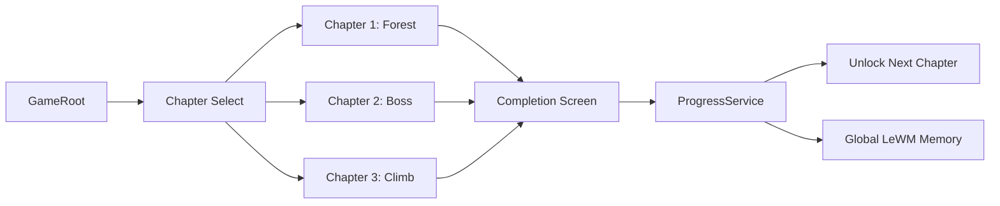

# GiacMoCoTich Implementation and Applied Knowledge

## Summary

This document summarizes the work completed on the Godot 2D prototype, the design and engineering knowledge applied, and the current runtime shape of the project.

The project was moved away from the original Unity / visual-novel direction into a stage-based Godot 2D game. Each chapter now has a different gameplay style, but all chapters share a common chapter flow, local progression, star scoring, and a LeWorldModel-inspired reaction layer.

The current target is a PC Windows prototype built with Godot 4.x.

## Current Game Structure

The game is organized around a central `GameRoot` scene that controls the player-facing flow:

- Chapter selection.
- Sequential unlocks from Chapter 1 to Chapter 3.
- Runtime HUD.
- Completion screen.
- Star rating.
- Local save/load through `user://progress.json`.
- Global memory seeding for the LeWorldModel-inspired system.



## Gameplay Implemented

### Chapter 1 - Forest Introduction

Chapter 1 is a topdown forest stage inspired by classic 2D adventure games. The player controls Thach Sanh with WASD, explores clues, talks to Ly Thong, and leads him to the east exit.

Implemented behaviors:

- WASD movement.
- Tile-like placeholder forest map.
- Collision with borders, trees, and rocks.
- Three interactable clue objects.
- Ly Thong spawn, dialogue, and follow behavior.
- Exit completion trigger.
- Fix for the earlier issue where Ly Thong had to stand exactly inside the exit rectangle. The trigger now completes when the player reaches the expanded exit area while Ly Thong is following nearby.

### Chapter 2 - Topdown Boss Combat

Chapter 2 is an offline player-vs-boss topdown combat stage inspired by games like Soul Knight.

Implemented behaviors:

- Preparation area before the arena.
- Clue reading.
- Trap avoidance.
- Free weapon switching with `1` for axe and `2` for bow.
- Mouse aim for bow.
- Left mouse attack.
- Dash with Space or right mouse.
- Player HP and boss HP.
- Boss behavior that reacts to player habits through the LeWorldModel-inspired system.
- Telegraph rings before dangerous hazards or counter attacks.
- Restart on player death.

### Chapter 3 - Vertical Climb

Chapter 3 is a strict side-view vertical climbing stage inspired by Jump King.

Implemented behaviors:

- A/D movement.
- Hold Space to charge.
- Release Space to jump.
- Gravity and platform collision.
- Vertical camera following the player.
- Fall counting.
- Height progress.
- Wind effects.
- Ghost platform effects.
- Trajectory/landing echo feedback when LeWorldModel detects repeated misses.

## Progression, Scoring, and Completion

The prototype now uses a linear chapter progression:

- Chapter 1 is unlocked by default.
- Chapter 2 unlocks after Chapter 1 is completed.
- Chapter 3 unlocks after Chapter 2 is completed.

Star scoring is calculated after completing a chapter. The current criteria are:

- Chapter 1: completion, clue count, time, and dream stability.
- Chapter 2: boss defeated, remaining HP, time, and danger spikes.
- Chapter 3: reaching the top, fall count, and time.

Important UI decision: score and star details do not appear during gameplay. They appear only after the stage is completed.

This keeps the map visible and avoids turning the gameplay screen into a score dashboard.

## UI and UX Decisions

The HUD was redesigned several times based on playability feedback. The current direction is gameplay-first:

- Keep the map as visible as possible.
- Avoid large panels over the play area.
- Show only essential information during gameplay.
- Move scoring, criteria, and LeWorldModel impact details to the completion screen.

Current runtime HUD:

- Small objective panel in the top-left.
- Small timer in the top-right.
- Short contextual prompt at the bottom when useful.
- Debug state remains hidden behind `F9`.

Completion screen:

- Stars earned.
- Completion time.
- Scoring criteria.
- LeWorldModel Impact summary.
- Next chapter, replay, and chapter select buttons.

Applied UI/UX principles:

- Reduce cognitive load during active play.
- Keep gameplay information close to the moment of action.
- Avoid showing debug-like state by default.
- Use high-contrast text panels only when needed.
- Prefer in-world telegraphs over permanent dashboard numbers.
- Keep score feedback for the end-of-stage reward moment.

## Godot Knowledge Applied

The implementation uses Godot-native patterns:

- `Node2D` chapter scenes for lightweight 2D gameplay.
- `CanvasLayer` for UI that stays above gameplay.
- `Control`, `PanelContainer`, `VBoxContainer`, `HBoxContainer`, `Label`, `Button`, and `ProgressBar` for UI.
- GDScript signals for chapter completion.
- `FileAccess` and JSON for local save data.
- Scene preloading for chapter scenes.
- `_physics_process` for gameplay updates.
- `_draw` for simple placeholder art, telegraphs, and visual effects.
- Headless Godot test execution through `godot_console.exe`.

## Architecture Knowledge Applied

The implementation favors a modular chapter architecture:

- Shared systems handle progression, scoring, world state, and LeWorldModel reactions.
- Each chapter owns its own movement and gameplay loop.
- Chapters expose a small common interface:
  - `get_objective_text()`
  - `get_hud_data()`
  - `get_completion_payload()`
  - `apply_global_memory(memory)`
  - `chapter_completed(chapter_id, payload)`

This avoids forcing three different gameplay modes into one controller while still keeping progression and completion consistent.

## Security and Scope Decisions

Several scope decisions were made to keep the MVP reliable:

- No real Python/PyTorch LeWorldModel sidecar in the MVP.
- No remote model calls.
- No downloaded external assets required for the placeholder prototype.
- No procedural map generation for Chapter 1.
- Local-only save data.
- Rule-based LeWorldModel-inspired behavior written in GDScript.

These choices reduce dependency risk, performance risk, and security surface.

## Testing and Tooling

The project includes a headless test script:

```powershell
powershell -ExecutionPolicy Bypass -File .\tools\test_godot.ps1
```

The smoke tests cover:

- Scene loading.
- Score calculation.
- Progress unlock behavior.
- Legacy save compatibility with global memory.
- LeWorldModel reaction contracts.
- Chapter 1 exit completion.
- Required completion payload fields for LeWorldModel impact and memory updates.

Godot MCP was also connected and verified through `http://localhost:9080/mcp`. A helper script was added:

```powershell
powershell -ExecutionPolicy Bypass -File .\tools\godot_mcp.ps1 -Method tools/call -ParamsJson '{"name":"get_project_info","arguments":{}}'
```

This allows Codex to inspect and control the Godot editor through JSON-RPC when the Godot MCP plugin is running.

