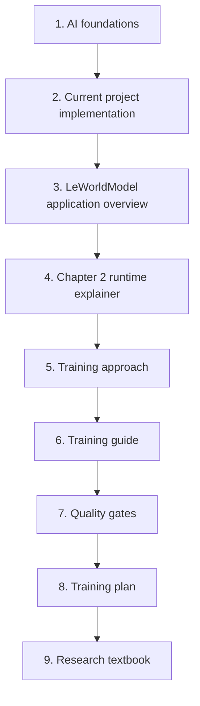
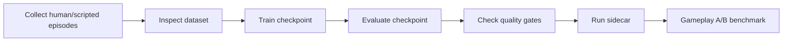

# LeWM Documentation Index

This folder contains the LeWorldModel-related documentation for the Godot prototype: AI foundations, current runtime behavior, Chapter 2 training, quality gates, and the longer research roadmap.

## Recommended Reading Order

## Read This First

1. `ai_foundations_for_plan.md`
   - Start here if you need the vocabulary: world model vs policy, telemetry, baselines, benchmarking, and common AI evaluation traps.

2. `implementation_and_applied_knowledge.md`
   - Read this next to understand how the current Godot chapters, progression, scoring, audio, and LeWM reaction layer fit together.

3. `leworldmodel_application.md`
   - Explains how the local Python/PyTorch sidecar, Godot client, safe reaction contract, and rule fallback work at runtime.

## Chapter 2 Runtime And Training

4. `chapter2_lewm_applied_runtime_explainer.md`
   - Explains what LeWM controls in Chapter 2, what remains deterministic Godot logic, and how boss reactions are exposed to the player.

5. `chapter2_lewm_training_approach.md`
   - Explains why this project uses a small LeWM-inspired training path first instead of attempting a full paper reproduction immediately.

6. `chapter2_lewm_training_guide.md`
   - Operational guide for collecting Chapter 2 rollouts, training a checkpoint, evaluating it, and running the sidecar.

7. `lewm_training_quality_gates.md`
   - Use this before accepting any checkpoint. It defines smoke/review/research thresholds, collapse checks, runtime latency expectations, and common training failure modes.

## Roadmap And Research Depth

8. `leworldmodel_training_plan_v1.md`
   - Engineering plan for the raw-pixel LeWM training stack, including dataset inspection, device benchmark, evaluation, safety, and artifact policy.

9. `leworldmodel_research_textbook_v1.md`
   - Long-form research reference that connects the current prototype to the longer-term raw-pixel LeWorldModel roadmap.

## Practical Training Loop

For daily work, use this shorter loop:

The checkpoint is only research-ready when `lewm_training_quality_gates.md` passes for dataset quality, offline metrics, runtime latency, and gameplay A/B behavior.
