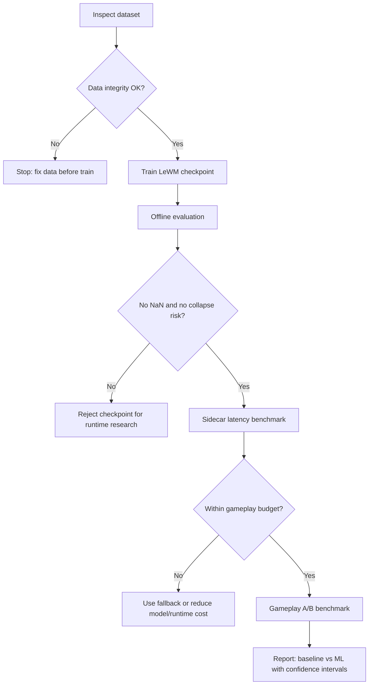

# LeWM Training Quality Gates

Tài liệu này định nghĩa cách đọc số liệu train/evaluate LeWM trong project, phân biệt mức **smoke**, **review-ready**, và **research-ready**. Các ngưỡng dưới đây là quality gate thực dụng cho repo này, không phải chuẩn tuyệt đối cho mọi world model.

## Decision Flow



## Quality Gate Summary

| Area | Fail | Smoke OK | Review-ready | Research-ready |
|---|---|---|---|---|
| Episodes | `< 2` episodes | `2-5` episodes | `30-50` episodes | `80+` episodes plus held-out test scenarios |
| Transitions | `< 500` train transitions | `1k-3k` transitions | `10k-20k` transitions | `30k+`; prefer `100k+` for strong claims |
| Split | Transition split with adjacent-frame leakage | Episode-safe train/val split | Episode-safe plus balanced profiles | Train/val/test split by episode, seed, and behavior profile |
| Data integrity | Missing frames, malformed JSON, image-size mismatch | No missing/malformed rows | Metadata rows close to action rows | Same as review plus reproducible collection script |
| Data coverage | One scripted behavior only | At least one useful behavior path | Human + scripted, spam/kite/aim/dash/corner/balanced | Multiple seeds, difficulty states, wins/losses, and unseen profiles |
| `total_loss` | `NaN` or exploding | Finite and not increasing without bound | Stable across epochs | Reported, but not used alone as proof |
| `prediction_loss` | `NaN`, flat high loss, or diverging val | Clearly decreases | Low on val and stable across reruns | Beats baselines on held-out test episodes |
| Train/val gap | Val loss diverges while train drops | Acceptable for smoke if noted | Val prediction loss normally within `3x-5x` train prediction loss | Stable across seeds and held-out profiles |
| Latent diagnostics | `latent_effective_rank < 8` or near-total variance collapse | `latent_effective_rank >= 16` | `latent_effective_rank >= 32` and stable | Latent probes show behavior-relevant information |
| Runtime latency | p95 exceeds Godot timeout or frequent sidecar errors | p95 under `95ms` runner latency | p95 under `50ms` runner latency | p95/p99 reported under real gameplay load |
| ML acceptance | Always fallback or unsafe intents | ML accepted in controlled scene | Acceptance rate is explainable by confidence/latency gates | A/B gameplay metrics improve without fairness regression |

## How To Read The Current Metrics

The current trainer uses:

```text
total_loss = prediction_loss + gaussian_weight * gaussian_regularizer
```

For Chapter 2, `gaussian_weight` is `0.05`. If `gaussian_regularizer` is around `1.0`, then `total_loss` naturally has a floor near `0.05`. Do not claim the model is good only because `total_loss ~= 0.05`. For research, report these fields separately:

- `train_prediction_loss`
- `val_prediction_loss`
- `gaussian_regularizer`
- `latent_variance_mean`
- `latent_effective_rank`
- runtime p50/p95/p99 latency
- ML acceptance rate in Godot
- gameplay A/B metrics against rule fallback

## Current Smoke Run Assessment

Latest local smoke run on `chapter_2`:

| Metric | Value | Interpretation |
|---|---:|---|
| Samples | `2697` | Smoke only; below review/research threshold |
| Train transitions | `1299` | Enough to verify pipeline, not enough for a strong model |
| Val transitions | `1398` | Episode-safe validation exists |
| Best val loss | `0.0500024600` | Mostly regularizer floor; not a standalone quality claim |
| Offline eval `prediction_loss` | `1.2765e-06` | Numerically low, but must be interpreted with dataset size |
| `latent_variance_mean` | `2.3071e-09` | Collapse risk for research; needs more diverse data and latent checks |
| `latent_effective_rank` | `46.8` | Better than total collapse, but still needs validation on richer data |
| Device throughput | `203.68 samples/s` on CPU | OK for local iteration |
| Sidecar runner p95 | `3.53ms` | Good for runtime budget |
| HTTP wall p95 | `29.19ms` | Good under current local test |

Verdict: this checkpoint is good for **pipeline smoke testing** and sidecar integration. It is not yet strong enough as a final research result.

## Gameplay Benchmark Metrics

To claim "LeWM improves the boss", compare these modes:

| Mode | Purpose |
|---|---|
| `--lewm-mode=fallback` | Rule-based baseline and safety fallback |
| `--lewm-mode=auto` | Real runtime mode: ML only when confidence and latency pass |
| `--lewm-mode=ml` | Stress test ML behavior; not the default player experience |

Minimum metrics per mode:

| Metric | Good Sign | Bad Sign |
|---|---|---|
| Win/loss rate | Similar or more interesting than baseline without unfair spikes | Boss becomes impossible or trivial |
| Player damage taken | Increases only when behavior read is justified | Damage spikes without readable telegraph |
| Time to defeat boss | Changes are explainable by tactic adaptation | Large variance from random/unreadable behavior |
| Boss hit rate | Tactic-specific improvement, not constant spam | One tactic dominates all fights |
| Tactic diversity | Multiple intents appear across profiles | Always `PunishSpam` or always `BalancedPressure` |
| ML acceptance rate | Healthy acceptance in valid situations | Always fallback, or accepts every request blindly |
| Latency p95/p99 | Under runtime budget | Frequent timeout/fallback |

Recommended research minimum:

- `100+` episodes per mode.
- `3-5` seed groups.
- Report mean, standard deviation, and preferably confidence intervals.
- Include at least one held-out behavior profile that was not used in training.

## Common AI Training Failure Modes

| Symptom | Likely Cause | How To Detect | Fix |
|---|---|---|---|
| `NaN` loss | Learning rate too high, corrupt image, AMP issue | Training log shows `NaN` or crash | Inspect dataset, lower LR, train on CPU/FP32 first |
| Very low train loss, bad gameplay | Overfit to one scripted profile | Val/test profile fails, tactic diversity low | Add human data and varied scripted profiles |
| Val loss looks too good | Data leakage from adjacent frames | Split by transition, not episode | Keep `split_unit: episode`; add held-out test episodes |
| Latent variance near zero | Representation collapse or low data diversity | `latent_variance_mean` tiny, rank low or falling | Add diverse episodes; verify frames/actions are not constant |
| Model always chooses one intent | Candidate scoring biased or dataset too narrow | Intent histogram dominated by one tactic | Balance collection profiles; benchmark per profile |
| ML always falls back | Low confidence, high latency, unsafe output | Godot debug shows fallback reason | Check sidecar, confidence threshold, latency, candidate contract |
| Runtime feels unfair | Model selects valid but poor UX reactions | Player damage spikes without telegraph | Keep guardrail, tune candidate effects, compare with fallback |
| Benchmark cannot be reproduced | No fixed seeds or episode logs | Reruns produce incompatible claims | Save seed, mode, profile, commit SHA, checkpoint version |

## Required Commands Before Accepting A Checkpoint

One-command human collection and training cycle:

```powershell
powershell -ExecutionPolicy Bypass -File .\tools\run_lewm_human_training_cycle.ps1 -Chapter chapter_2
```

Linux/macOS:

```bash
bash ./tools/run_lewm_human_training_cycle.sh --chapter chapter_2 --godot-bin godot
```

Manual equivalent:

```powershell
powershell -ExecutionPolicy Bypass -File .\tools\inspect_lewm_dataset.ps1 -Chapter chapter_2
powershell -ExecutionPolicy Bypass -File .\tools\train_lewm_chapter.ps1 -Chapter chapter_2
powershell -ExecutionPolicy Bypass -File .\tools\evaluate_lewm_checkpoint.ps1 -Chapter chapter_2
powershell -ExecutionPolicy Bypass -File .\tools\benchmark_lewm_device.ps1 -Chapter chapter_2 -BatchSize 32 -Steps 30
powershell -ExecutionPolicy Bypass -File .\tools\start_lewm_sidecar.ps1 -Checkpoint .\models\lewm\chapter_2\checkpoints\best.pt
```

Accept for research only when:

1. Dataset inspection has no missing files, malformed rows, or image-size mismatches.
2. Dataset has enough episodes and behavior coverage for the target claim.
3. Validation is episode-safe, not transition-leaked.
4. `prediction_loss` is finite and stable.
5. Latent diagnostics do not show collapse risk.
6. Sidecar loads `best.pt` and p95 latency is inside budget.
7. Gameplay A/B benchmark beats or matches fallback without fairness regression.
