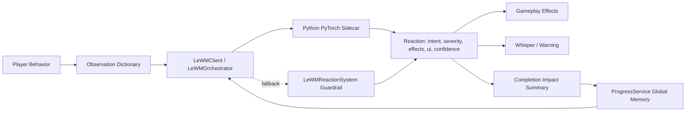

# LeWorldModel Application in GiacMoCoTich

## Summary

The MVP now integrates a real local LeWorldModel ML runtime through a Python/PyTorch sidecar on `127.0.0.1`. Godot sends downscaled gameplay frames, action vectors, scalar context, and safe candidate reactions to the sidecar. The sidecar runs a JEPA-style pixel/action latent predictor and returns a standardized reaction.

The existing rule-based `LeWMReactionSystem` remains as the safety fallback and baseline. If the sidecar is offline, too slow, or returns an unsafe intent, Godot rejects the ML output and applies the fallback reaction.

The core idea is:

- Observe player behavior.
- Encode that behavior into world state.
- Predict or infer what the world should react to.
- Apply visible gameplay reactions.
- Save selected memory across chapters.
- Explain the reaction after the stage through the completion screen.



## What Was Implemented

The LeWorldModel MVP runtime is split into five parts:

- `WorldState`: stores runtime chapter state and persistent global memory.
- `LeWMClient`: sends Godot frame/action/context payloads to the localhost sidecar.
- `LeWMOrchestrator`: treats ML as primary, sanitizes ML output, and falls back to rules.
- `LeWMReactionSystem`: fallback guardrail and deterministic baseline.
- `ml_sidecar/`: FastAPI/Pydantic service using the PyTorch model code in `research/lewm`.
- `ProgressService`: saves global memory deltas into `user://progress.json`.

Each reaction now follows a common contract:

```text
intent:   What the world thinks is happening.
severity: How strong the reaction is, from 0 to 100.
effects:  Gameplay effect names.
ui:       Whisper, warning, and label text.
source:   `ml` or `fallback`.
confidence/model_version/latency_ms: ML observability fields.
```

This makes the system easier to extend for Chapter 4 and Chapter 5.

## Runtime Memory and Global Memory

The project uses hybrid memory:

- Runtime memory resets per chapter.
- Global memory persists across completed chapters.

Global memory includes:

- `trust_ly_thong`
- `suspicion`
- `danger_bias`
- `combat_spam_bias`
- `combat_kite_bias`
- `climb_anxiety`
- `dream_instability`

The purpose is not to punish the player forever. Global memory only seeds later chapters lightly, so the world feels like it remembers without making the game unfair.

## Chapter 1 - Forest Reactions

Chapter 1 observes:

- How long the player stays in the forest.
- How many clues are found.
- Whether the player wanders or backtracks.
- Distance to Ly Thong.
- Whether the player leads Ly Thong toward the exit.

Possible LeWorldModel reactions:

| Intent | Trigger | Gameplay Effect | Player Recognition |
|---|---|---|---|
| `ObjectMemory` | Player finds enough clues | Objects and forest whisper differently | The bottom prompt changes; clues feel remembered |
| `TemporalFog` | Player stays too long or dream instability is high | Fog becomes stronger | The forest becomes visually less clear |
| `PathShift` | Player wanders before talking to Ly Thong | Path-like visual bands and reverse leaves appear | The map feels unstable without blocking progress |
| `TrustGuide` | Player leads Ly Thong toward the exit | Exit guidance becomes brighter | The exit becomes easier to read |

Important rule: LeWorldModel must not block Chapter 1 completion. It can make the forest clearer, stranger, or more unstable, but it cannot prevent the player from finishing.

## Chapter 2 - Boss Reactions

Chapter 2 observes behavior in short combat windows:

- Attack frequency.
- Bow usage ratio.
- Bow accuracy.
- Distance from boss.
- Weapon switching frequency.
- Dash frequency.
- Whether the player read the clue.
- Whether the player cleared the trap.

Possible LeWorldModel reactions:

| Intent | Trigger | Gameplay Effect | Player Recognition |
|---|---|---|---|
| `PunishSpam` | Player repeatedly attacks with axe | Boss prepares a counter ring | A visible telegraph appears before damage |
| `CloseGap` | Player kites with bow from far away | Boss moves faster toward player | Boss visibly shortens distance |
| `AntiAim` | Player lands accurate bow shots | Boss starts zigzag movement | Bow shots become harder to line up |
| `WeaponRead` | Player switches weapons too often | Boss reads timing and pressures the player | Bottom prompt warns that boss is reading weapon swaps |
| `BalancedPressure` | No strong pattern detected | Boss applies baseline pressure | Combat remains stable |

Preparation matters. Reading clues and clearing traps reduce the severity of early boss reactions. This makes the preparation area meaningful without forcing a long tutorial.

## Chapter 3 - Climb Reactions

Chapter 3 observes:

- Fall count.
- Height progress.
- Idle time.
- Repeated misses in a similar vertical zone.

Possible LeWorldModel reactions:

| Intent | Trigger | Gameplay Effect | Player Recognition |
|---|---|---|---|
| `WindMemory` | Player falls many times or has high climb anxiety | Wind pushes the player | Wind arrows appear before or during the effect |
| `HighAltitudeWind` | Player climbs past mid height | Stronger altitude wind | The higher area feels more dangerous |
| `MountainBreath` | Player stays idle too long | Ghost platform appears briefly | A translucent platform appears with a countdown |
| `LandingEcho` | Player repeats failed jumps | Trajectory echo appears | A faint jump guide appears without playing for the user |

The system is intentionally not an auto-assist. It gives readable feedback, but the player still has to execute the jump.

## How Players Can Recognize LeWorldModel

The player should not need to read debug numbers to understand that the world is reacting.

Players recognize LeWorldModel through:

- Environmental changes, such as fog and reverse leaves in Chapter 1.
- Brighter exit guidance when Ly Thong is being led correctly.
- Boss movement changes in Chapter 2.
- Telegraph rings before boss counters or hazards.
- Bottom prompt warnings when the boss reads a behavior pattern.
- Wind arrows in Chapter 3.
- Ghost platform countdowns.
- Trajectory echo after repeated missed jumps.
- The `LeWorldModel Impact` section on the completion screen.

The completion screen is the explicit explanation layer. During gameplay, the system should be felt through the world, not through a large analytics dashboard.

## Why the Gameplay HUD Is Minimal

Earlier versions showed score previews and multiple LeWorldModel meters during gameplay. That made the map harder to see and hurt UI/UX.

The current decision is:

- During gameplay: show only objective, small timer, and contextual prompts.
- After completion: show stars, criteria, and LeWorldModel Impact.

This keeps the player focused on movement, combat, and navigation while preserving explainability at the end of the stage.

## Testing Strategy

Smoke tests verify:

- LeWorldModel reactions expose `intent`, `severity`, `effects`, and `ui`.
- Chapter completion payloads include `lewm_impact` and `global_memory_delta`.
- Legacy saves without global memory keys still load safely.
- Chapter 1 still completes even when LeWorldModel effects are active.
- Boss spam behavior triggers a strong `PunishSpam` reaction.
- Climb failures can trigger wind and trajectory echo behavior.

Manual validation through Godot MCP verifies:

- The project can run from the editor.
- The editor returns to normal after testing.
- Runtime logs do not report UI or script errors.

## MVP Boundary

The MVP uses real local ML, but keeps the blast radius controlled:

- Python/PyTorch runs outside Godot as a localhost sidecar.
- Godot never executes remote model output directly; it only accepts known reaction intents.
- Large rollout data and checkpoints stay out of git under `ml_data/` and `models/lewm/`.
- The sidecar can load trained checkpoints through `LEWM_CHECKPOINT`.
- If ML is unavailable, rule fallback keeps the game playable.
- No remote AI service calls are part of the gameplay MVP.

This keeps the project aligned with real LeWorldModel-style ML while preserving deterministic guardrails for a playable Godot prototype.
