# LeWorldModel Research Textbook for GiacMoCoTich

**Version:** 1.0
**Project:** GiacMoCoTich Godot Research Prototype
**Focus:** From rule-based LeWM-inspired gameplay to full raw-pixel LeWorldModel research
**Diagram target:** Mermaid.js v11.15.0

## Preface

This document consolidates the project documentation about chapters, LeWorldModel-inspired gameplay, Chapter 2 boss adaptation, AI foundations, and the proposed full raw-pixel LeWorldModel research roadmap.

The game is treated as a research environment. Its purpose is not only entertainment. Its purpose is to provide a controllable visual world where LeWorldModel-style learning, prediction, planning, and evaluation can be studied.

The current implementation is **LeWM-inspired and rule-based**. The long-term research target is a **raw-pixel LeWorldModel**:

```text
raw pixels + action -> future latent state -> planning in latent space -> game action
```

This document is written as a textbook-style reference: it introduces the theory, maps it to the current Godot project, defines what must be implemented, and describes what results should be expected.

## Learning Objectives

After reading this document, a developer or researcher should understand:

1. What a world model is and how it differs from a policy.
2. What LeWorldModel contributes: raw-pixel JEPA training, latent prediction, Gaussian regularization, and reconstruction-free learning.
3. How the current Godot project applies a simplified LeWM-inspired reaction layer.
4. What data must be collected to train a real raw-pixel LeWorldModel.
5. How training, probing, planning, and evaluation should be organized.
6. What results would count as meaningful research evidence.

---

# Part I - Foundations

## 1. World Models

A **world model** learns how an environment changes. It answers:

> If the current observation is `x_t` and an action `a_t` is taken, what is likely to happen next?

A policy answers a different question:

> What action should be taken now?

The two systems work together:

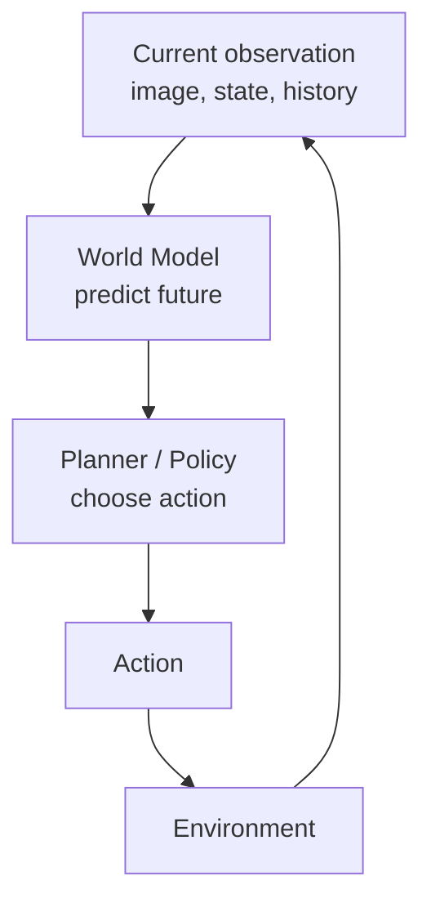

In a game, the world model should learn the dynamics of the environment: movement, collisions, projectiles, hazards, boss behavior, and consequences of actions.

## 2. Raw Pixels vs Hand-Crafted Features

The current project uses hand-crafted features such as:

- attack frequency,
- bow ratio,
- aim accuracy,
- distance to boss,
- corner time,
- player HP ratio.

These features are useful for an MVP, but they are not full raw-pixel learning. A raw-pixel world model learns from rendered frames:

```text
frame_t + action_t -> frame_t+1 latent representation
```

The model is not told directly what the boss HP or player distance is. If the latent space is good, those quantities should be recoverable through probing.

## 3. JEPA

JEPA means **Joint-Embedding Predictive Architecture**. Instead of reconstructing future pixels, JEPA predicts future **latent embeddings**.

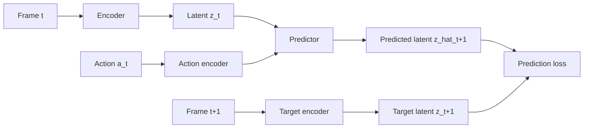

The key idea is that the model learns representations useful for predicting the future without wasting capacity on pixel-perfect reconstruction.

## 4. LeWorldModel

LeWorldModel, or LeWM, is a JEPA-style world model that trains end-to-end from raw pixels. The paper presents it as a stable approach that avoids several common world-model complications:

- no frozen pre-trained vision encoder,
- no pixel reconstruction objective,
- no reward supervision requirement for world-model training,
- no large set of hand-tuned auxiliary losses.

The core training objective can be summarized as:

```text
loss = next_embedding_prediction_loss + Gaussian_regularization_loss
```

The regularizer is used to prevent representation collapse, where every input maps to nearly the same latent vector.

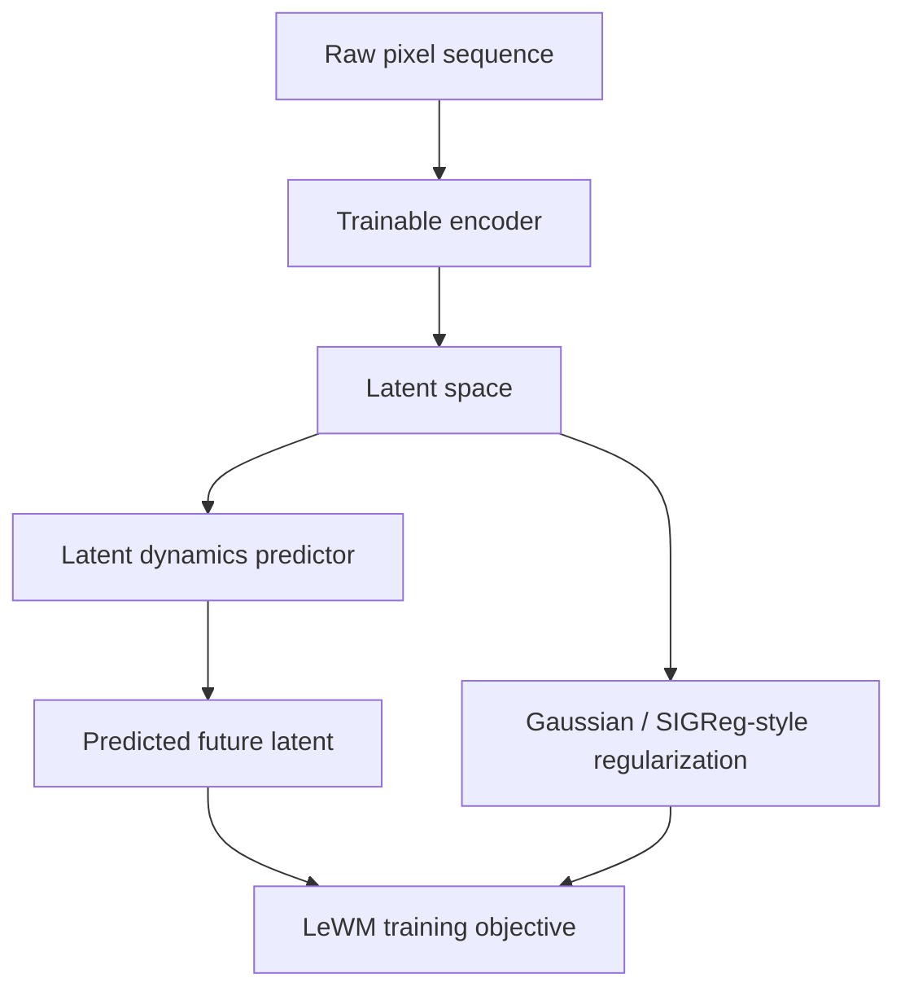

The research target for this project is to reproduce this principle in the game environment, then use the learned latent model for planning.

---

# Part II - Current Project Report

## 5. Game Structure

GiacMoCoTich is currently a Godot 2D prototype with three chapters:

| Chapter | Gameplay type | Current LeWM role |
|---|---|---|
| Chapter 1 - Forest | Top-down exploration | Dream fog, path shift, object memory, exit guidance |
| Chapter 2 - Chằn Tinh | Top-down boss combat | Boss reads player behavior and changes tactic |
| Chapter 3 - Climb | Vertical precision platforming | Wind, ghost platform, trajectory echo |

Shared systems:

- `GameRoot.gd`: chapter select, HUD, completion overlay.
- `WorldState.gd`: runtime state and global memory.
- `LeWMReactionSystem.gd`: rule-based LeWM-inspired reactions.
- `ProgressService.gd`: save/load and cross-chapter memory.
- `ChapterScoreCalculator.gd`: stars and completion criteria.

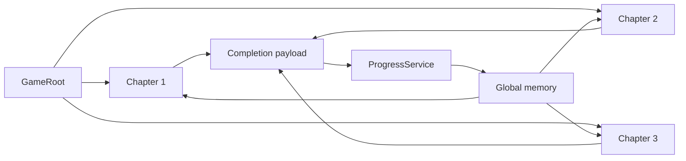

## 6. Current LeWM-Inspired Runtime

The current implementation is a deterministic symbolic world-reaction system.

It follows this loop:

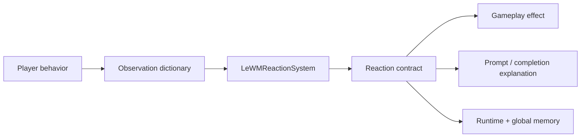

The reaction contract contains:

| Field | Meaning |
|---|---|
| `intent` | What the system believes is happening |
| `severity` | Strength of the reaction from 0 to 100 |
| `effects` | Gameplay effect tags |
| `ui.whisper` | Short contextual message |
| `ui.warning` | Warning text for dangerous reactions |

## 7. Chapter 2 Current Boss Adaptation

Chapter 2 observes combat behavior in 3-second windows.

Current metrics:

| Metric | Runtime meaning |
|---|---|
| `attack_frequency` | Number of attacks in a window |
| `bow_ratio` | Fraction of attacks that are bow shots |
| `aim_accuracy` | Bow hits divided by bow shots |
| `distance_to_boss` | Current distance between player and boss |
| `weapon_switch_frequency` | Number of weapon switches |
| `dash_frequency` | Number of dashes |
| `early_dash_frequency` | Dashes before boss pressure commits |
| `corner_time` | Time spent near arena corners |
| `damage_taken_rate` | Recent damage taken by player |
| `player_hp_ratio` | Player HP normalized to 0..1 |
| `clue_read` | Whether the player prepared by reading clues |
| `trap_cleared` | Whether the player handled the trap |
| `repeated_tactic_windows` | How long the same boss tactic has repeated |

Current reactions:

| Reaction | Trigger pattern | Gameplay effect |
|---|---|---|
| `PunishSpam` | Repeated axe attacks | Counter ring |
| `CloseGap` | Bow kiting from far away | Faster chase |
| `AntiAim` | Accurate bow shots | Zigzag movement |
| `DelayedStrike` | Early dash habit | Delayed hit telegraph |
| `AreaDeny` | Holding a corner | Hazard telegraph |
| `WeaponRead` | Excessive weapon switching | Timing pressure |
| `BalancedPressure` | No dominant pattern | Stable baseline |

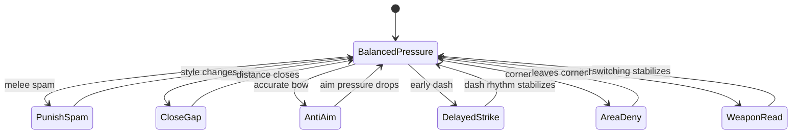

This current system is valuable as:

1. a gameplay prototype,
2. a baseline,
3. a teacher for early supervised labels,
4. a fallback for future ML inference failure.

It is not yet full raw-pixel LeWorldModel.

---

# Part III - Research Target

## 8. Full Raw-Pixel LeWorldModel Goal

The target research system should learn directly from visual frames produced by the game.

The core learning problem:

```text
Input:
  image_t
  action_t

Target:
  latent(image_t+1)

Learn:
  encoder(image)
  action_encoder(action)
  latent_predictor(latent_t, action_t)
```

The world model should be trained without direct reward labels and without reconstructing future pixels.

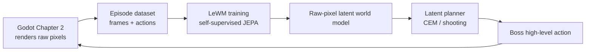

## 9. Why Chapter 2 Is The First Research Environment

Chapter 2 is the best starting point because it has:

- continuous real-time interaction,
- clear visual dynamics,
- player and boss positions,
- projectiles,
- hazards,
- HP bars,
- meaningful actions,
- existing rule-based baseline,
- measurable win/loss outcomes.

The research question becomes:

> Can a raw-pixel latent world model learn enough of Chapter 2 dynamics to support planning better than a rule-only baseline?

---

# Part IV - Data Design

## 10. Episode Recording

The game must record raw visual experience.

Recommended dataset layout:

```text
data/lewm_raw/chapter2/
  episodes/
    ep_000001/
      frames/
        000000.png
        000001.png
        000002.png
      actions.jsonl
      metadata.jsonl
      episode.json
```

Each `actions.jsonl` row:

```json
{
  "t": 42,
  "frame": "frames/000042.png",
  "next_frame": "frames/000043.png",
  "action": {
    "move_x": -1.0,
    "move_y": 0.0,
    "attack": 1,
    "dash": 0,
    "weapon_id": 0,
    "boss_action_id": 2
  }
}
```

Each `metadata.jsonl` row:

```json
{
  "t": 42,
  "player_hp": 88.0,
  "boss_hp": 310.0,
  "distance_to_boss": 142.5,
  "boss_tactic": "CloseGap",
  "arena_pressure": 12.0,
  "danger_spikes": 1
}
```

Metadata is not required for self-supervised LeWM training. It is required for probing, evaluation, debugging, and research reporting.

## 11. Frame Specification

Recommended v1 frame settings:

| Setting | Value |
|---|---|
| Resolution | `128x128` RGB |
| Source | Chapter 2 viewport capture |
| Rate | 10 FPS for training data |
| Format | PNG for inspection, later optional compressed arrays |
| Normalization | `[0, 1]` float tensors |

The first research target should prefer lower resolution. The goal is not visual fidelity. The goal is learning useful dynamics.

## 12. Action Specification

Actions should describe what the controlled agent does.

For boss-planning research, use high-level boss action IDs first:

| Action ID | Meaning |
|---|---|
| `0` | Balanced pressure |
| `1` | Chase / close gap |
| `2` | Counter melee |
| `3` | Zigzag / anti-aim |
| `4` | Delayed strike |
| `5` | Area deny |
| `6` | Projectile pressure |

Later, this can be expanded into lower-level continuous controls.

## 13. Dataset Phases

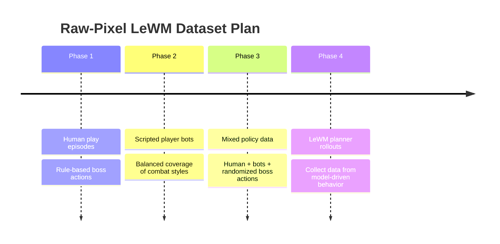

Minimum useful dataset for v1:

- 5,000 to 20,000 transitions for initial debugging,
- 100,000+ transitions for meaningful evaluation,
- multiple player styles: melee spam, bow kite, dash-heavy, corner-hold, balanced.

---

# Part V - Model Architecture

## 14. Components

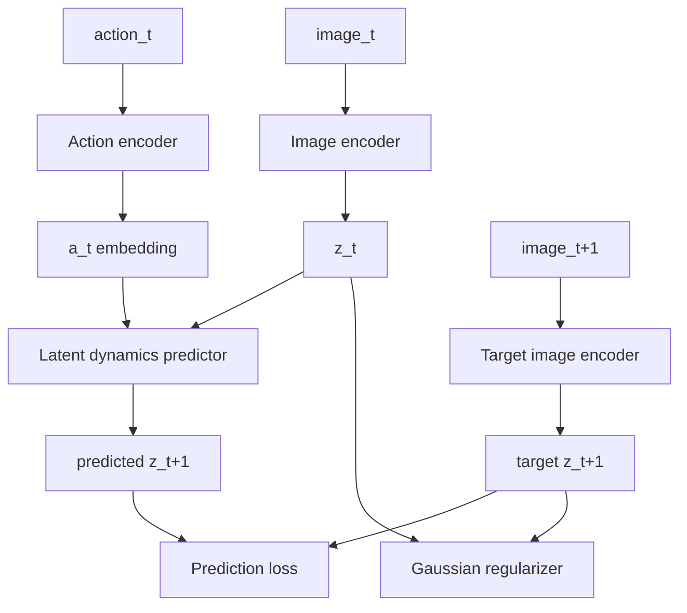

Recommended v1:

| Component | Suggested implementation |
|---|---|
| Image encoder | Small CNN or compact ViT |
| Action encoder | MLP over action vector |
| Predictor | MLP or shallow Transformer over latent + action |
| Latent dimension | 128 or 256 |
| Training framework | PyTorch |
| Hardware target | Single local GPU first |

## 15. Losses

The training objective should follow the LeWM principle:

```text
total_loss = prediction_loss + lambda * gaussian_regularization
```

Prediction loss:

```text
prediction_loss = mean_squared_error(predicted_z_next, target_z_next)
```

Gaussian regularization:

```text
encourage latent dimensions to behave like a stable Gaussian distribution
```

The exact implementation should be isolated in `research/lewm/lewm/losses.py` so it can be replaced or refined without rewriting the dataset and planner.

## 16. Anti-Collapse Diagnostics

A JEPA model can collapse if every image maps to nearly the same latent.

Track:

- latent mean,
- latent variance per dimension,
- covariance spectrum,
- effective rank,
- probe accuracy,
- nearest-neighbor diversity.

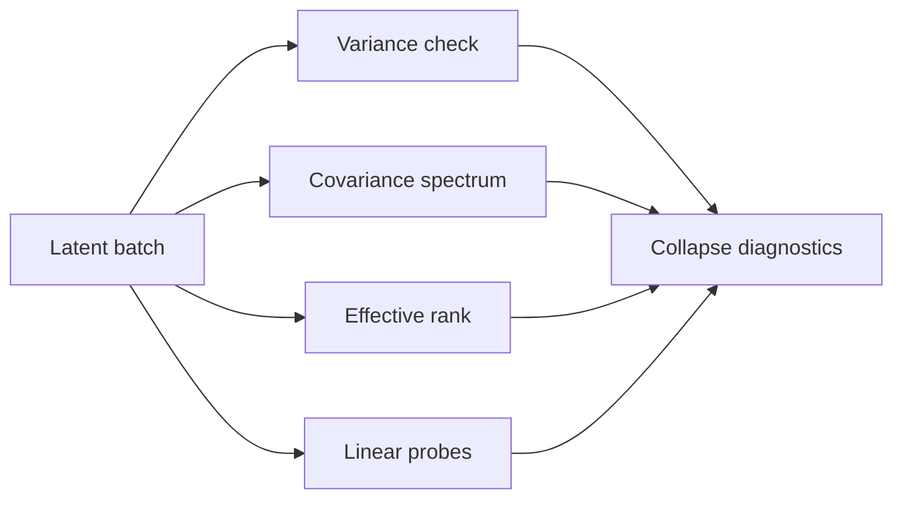

---

# Part VI - Training Pipeline

## 17. Training Stages

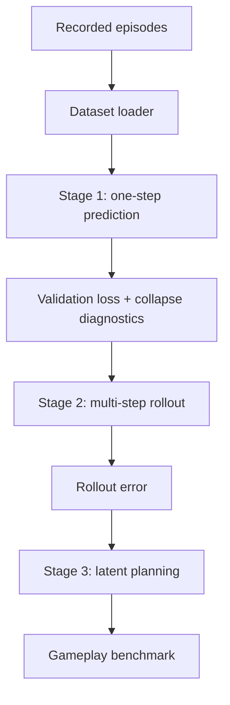

### Stage 1 - One-Step Prediction

Train on:

```text
(image_t, action_t, image_t+1)
```

Expected result:

- prediction loss decreases,
- latent variance does not collapse,
- basic probes recover simple state variables above chance.

### Stage 2 - Multi-Step Rollout

Train or evaluate:

```text
z_t -> action_t -> z_t+1 -> action_t+1 -> z_t+2 -> ...
```

Expected result:

- short rollouts remain stable,
- 3 to 10 step futures preserve useful structure.

### Stage 3 - Planning

Use the learned model to evaluate possible action sequences.

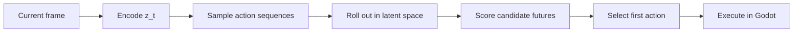

The planner can use:

- random shooting,
- Cross-Entropy Method,
- later, learned policy distillation.

---

# Part VII - Planning Objective

## 18. Boss Planning Score

The LeWM world model predicts future latent states. A planner still needs a score.

For boss research, score candidate futures by:

| Objective | Direction |
|---|---|
| Reduce player HP | Higher is better |
| Preserve boss HP | Higher is better |
| Maintain fair telegraphing | Required constraint |
| Avoid repeated unfair tactic | Required constraint |
| Keep latency low | Required constraint |

Because LeWM itself is reward-free, this score is not part of LeWM training. It is a planning utility used after the world model has learned dynamics.

## 19. Safety Constraints

The planner must not produce unplayable behavior.

Hard constraints:

- no damage without telegraph,
- no repeated unavoidable hazards,
- no model action if confidence or latency is unacceptable,
- fallback to current rule-based LeWM system.

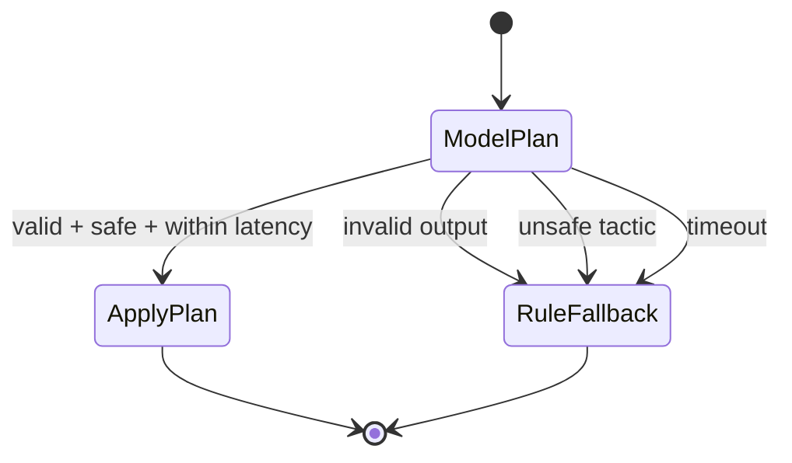

---

# Part VIII - Integration Architecture

## 20. Runtime System

Use a Python sidecar for research. Godot should not train the model.

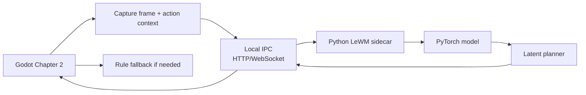

This keeps the research system flexible:

- PyTorch stays in Python,
- experiments can change quickly,
- Godot remains stable,
- the current GDScript system remains the fallback baseline.

## 21. Proposed Repository Structure

```text
research/lewm/
  README.md
  configs/
    collect_chapter2.yaml
    train_lewm_chapter2.yaml
    planner_chapter2.yaml
  datasets/
    chapter2_dataset.py
  models/
    encoder.py
    action_encoder.py
    predictor.py
    lewm.py
  losses/
    prediction.py
    gaussian_regularizer.py
  planning/
    cem.py
    random_shooting.py
    scoring.py
  scripts/
    train.py
    evaluate.py
    probe.py
    serve_sidecar.py
  reports/
    chapter2_baseline_report.md

data/lewm_raw/chapter2/
  episodes/

models/lewm/chapter2/
  checkpoints/
  exported/
```

## 22. Godot Additions

Required Godot-side additions:

| Area | Addition |
|---|---|
| Data collection | Frame capture and action logging |
| Determinism | Seeded runs and replay-friendly metadata |
| Sidecar client | Local request/response to Python planner |
| Fallback | Current `LeWMReactionSystem` remains available |
| Debug UI | F9 displays model/fallback status |
| Completion report | Store model usage, fallback rate, and planner latency |

## 22.1 Current V1 Implementation Guide

This repository now contains the first implementation slice of the raw-pixel LeWorldModel plan. It is intentionally small, inspectable, and safe to run locally.

Implemented files:

| Area | Path | Purpose |
|---|---|---|
| Textbook report | `docs/leworldmodel_research_textbook_v1.md` | Consolidated research foundation and implementation contract |
| Applied runtime explainer | `docs/chapter2_lewm_applied_runtime_explainer.md` | Explains the current rule-based Chapter 2 LeWM layer |
| Godot recorder | `scripts/shared/RawLeWMRecorder.gd` | Opt-in raw frame, action, and metadata recorder |
| Chapter 2 integration | `scripts/chapters/Chapter2Boss.gd` | Calls the recorder during active boss arena play |
| Research package | `research/lewm/lewm/` | Dataset, model, loss, and planner code |
| Training scripts | `research/lewm/scripts/` | Train, evaluate, and sidecar scaffold entry points |
| Configs | `research/lewm/configs/` | Chapter 2 train and planner defaults |

The v1 implementation follows this path:

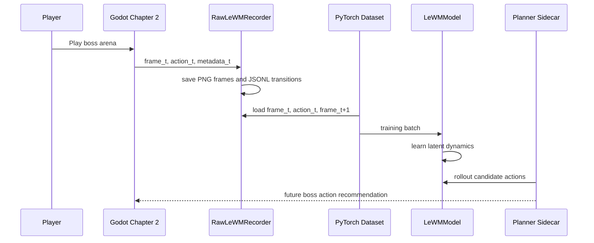

### Data Collection

Raw-pixel recording is disabled by default. Enable it only when collecting research data:

```bash
godot --path . -- --lewm-record --lewm-image-size=128 --lewm-capture-interval=0.10
```

The recorder writes one episode folder per run:

```text
data/lewm_raw/chapter2/episodes/<episode_id>/
  frames/
    000000.png
    000001.png
  actions.jsonl
  metadata.jsonl
  episode.json
```

Each transition row links one rendered frame to the next rendered frame:

```json
{"t": 0, "frame": "frames/000000.png", "next_frame": "frames/000001.png", "action": {"move_x": 0.0, "move_y": 1.0, "attack": 0, "dash": 0, "weapon_id": 0, "boss_action_id": 0}}
```

### Training

Install the research dependencies in a local Python environment:

```bash
pip install -r research/lewm/requirements.txt
```

Train the first Chapter 2 model after collecting episodes:

```bash
PYTHONPATH=research/lewm python3 research/lewm/scripts/train.py \
  --config research/lewm/configs/train_lewm_chapter2.yaml
```

Evaluate a checkpoint:

```bash
PYTHONPATH=research/lewm python3 research/lewm/scripts/evaluate.py \
  --config research/lewm/configs/train_lewm_chapter2.yaml \
  --checkpoint models/lewm/chapter2/checkpoints/best.pt
```

### Sidecar Scaffold

The Python sidecar exists as an integration boundary. In v1 it returns fallback responses until a trained checkpoint and scoring probe are connected.

```bash
PYTHONPATH=research/lewm python3 research/lewm/scripts/serve_sidecar.py \
  --host 127.0.0.1 \
  --port 8765
```

Security rule: keep the sidecar bound to `127.0.0.1` during research. Do not expose it on a public interface unless authentication, rate limits, request size limits, and model artifact validation are implemented.

### Security and Repository Hygiene

Raw captures and model checkpoints must not be committed. They may contain large frame dumps and gameplay telemetry, and checkpoints are binary artifacts that should be versioned through a separate model registry or artifact store.

The repository ignore rules cover:

- `data/lewm_raw/`
- `models/lewm/`
- Python bytecode caches
- local Codex/Godot runtime state
- PyTorch checkpoint extensions such as `.pt`, `.pth`, and `.ckpt`

The recorder is opt-in by command-line flag. Normal gameplay does not collect research data.

### Expected V1 Workflow

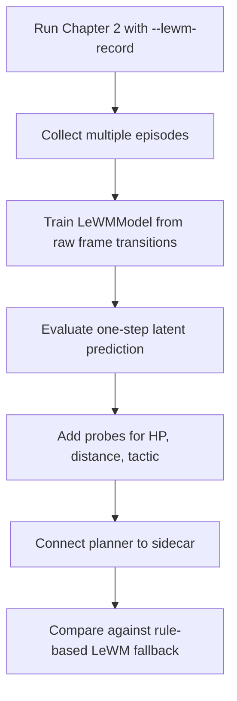

---

# Part IX - Evaluation

## 23. Model Metrics

Track:

- one-step prediction loss,
- multi-step rollout error,
- latent variance,
- effective rank,
- probe accuracy for HP, distance, tactic,
- inference latency.

## 24. Gameplay Metrics

Track:

- boss win rate,
- player win rate,
- average time to kill,
- player damage taken,
- boss damage taken,
- number of danger spikes,
- fairness violations,
- fallback rate,
- average planner latency.

## 25. Baselines

A research claim requires baselines.

Compare:

| System | Purpose |
|---|---|
| Random boss | Lower bound |
| Fixed FSM boss | Simple scripted baseline |
| Current rule-based LeWM | Strong deterministic baseline |
| Supervised tactic predictor | Feature-based ML baseline |
| Raw-pixel LeWM planner | Main research system |

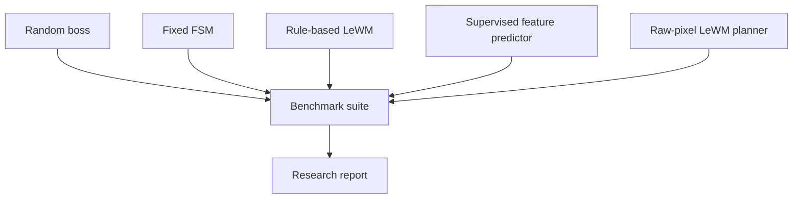

## 26. Expected Results

Reasonable v1 expectations:

- The model learns stable latents from low-resolution Chapter 2 frames.
- Linear probes can recover distance, HP, and tactic above chance.
- Short rollouts are useful for 3 to 5 planning steps.
- The LeWM planner can choose plausible boss actions.
- The rule-based fallback remains necessary for safety.

Unrealistic v1 expectations:

- perfect long-horizon visual prediction,
- full autonomous boss mastery,
- no fallback,
- production-ready standalone ML runtime,
- direct generalization to every chapter without new data.

---

# Part X - Implementation Roadmap

## 27. Milestones

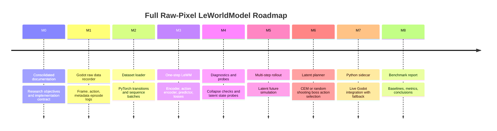

## 28. Definition of Done

The full research implementation is complete when:

1. Godot can record deterministic raw-pixel Chapter 2 episodes.
2. PyTorch can train a reconstruction-free LeWM-style model from those episodes.
3. Latent diagnostics show no collapse.
4. Probes show that latent state encodes meaningful game variables.
5. Multi-step latent rollouts remain useful over short horizons.
6. A planner can choose boss actions from imagined latent futures.
7. Godot can use the planner through a local sidecar.
8. The current rule-based system remains as a fallback.
9. Benchmarks compare LeWM against random, FSM, rule-based, and supervised baselines.
10. The report explains both successes and failures.

---

# Part XI - Glossary

| Term | Definition |
|---|---|
| World model | A model that predicts how the environment changes |
| Policy | A model or rule that chooses actions |
| JEPA | Joint-Embedding Predictive Architecture |
| LeWM | LeWorldModel |
| Latent | Compact internal representation |
| Collapse | Failure mode where representations become uninformative |
| Probe | Small supervised model used to test what latent encodes |
| CEM | Cross-Entropy Method, a sampling-based planner |
| Rollout | Simulated future sequence |
| Fallback | Safe deterministic behavior when model output is invalid |
| Telemetry | Logged data from gameplay |

---

# Part XII - References

- LeWorldModel official project page: <https://le-wm.github.io/>
- LeWorldModel arXiv paper: <https://arxiv.org/abs/2603.19312>
- Mermaid.js repository: <https://github.com/mermaid-js/mermaid>
- Mermaid.js releases: <https://github.com/mermaid-js/mermaid/releases>
- Current project docs consolidated into this file:
  - `docs/leworldmodel_application.md`
  - `docs/chapter2_lewm_applied_runtime_explainer.md`
  - `docs/chapter2_lewm_training_approach.md`
  - `docs/ai_foundations_for_plan.md`
  - `docs/implementation_and_applied_knowledge.md`

---

# Appendix A - Research Principle

The current game proves that LeWM-style reactions can improve gameplay readability. The full research target is stronger:

> Learn the game world from pixels, predict future latent states, and use those predictions to plan actions.

The game is therefore not the final product. It is the experimental apparatus.
