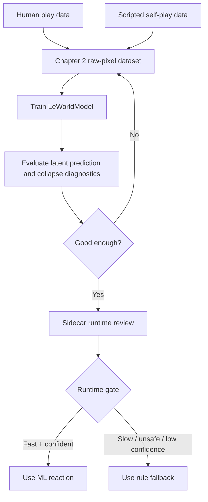
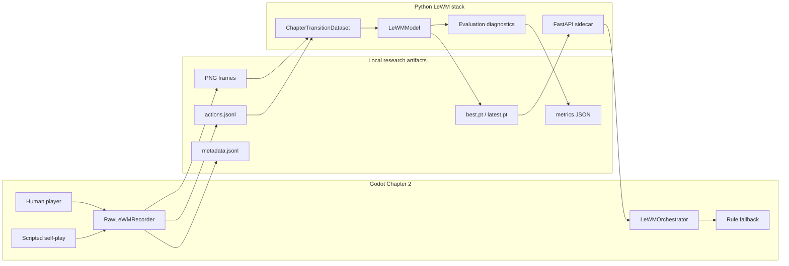
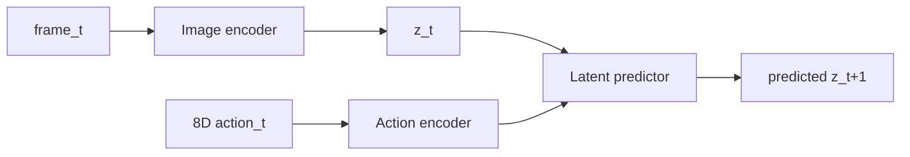
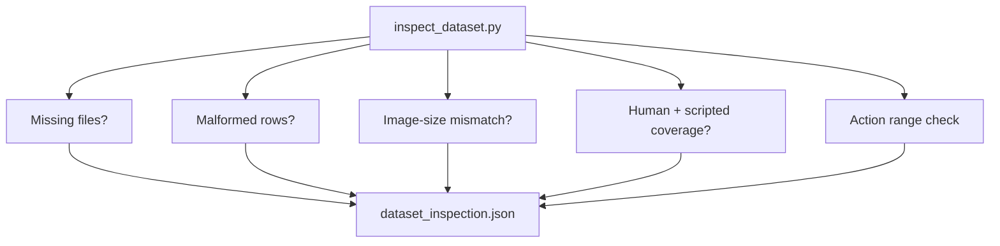
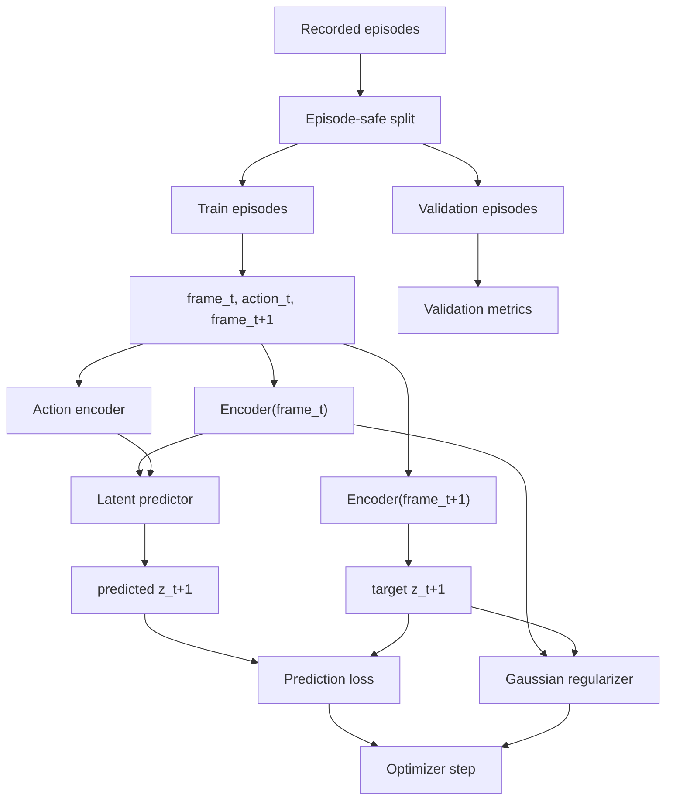
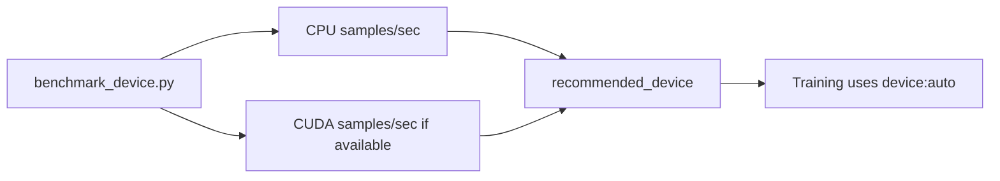
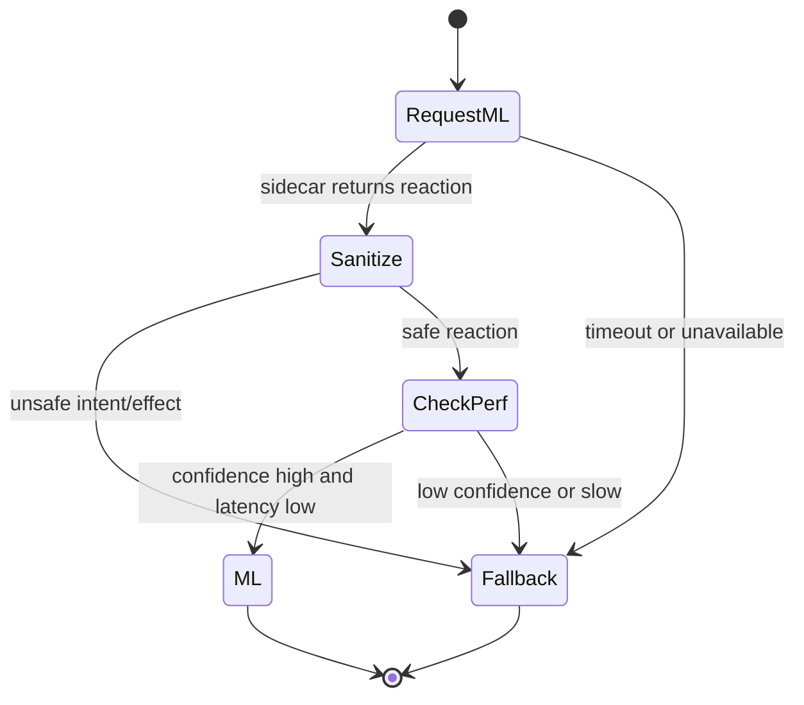
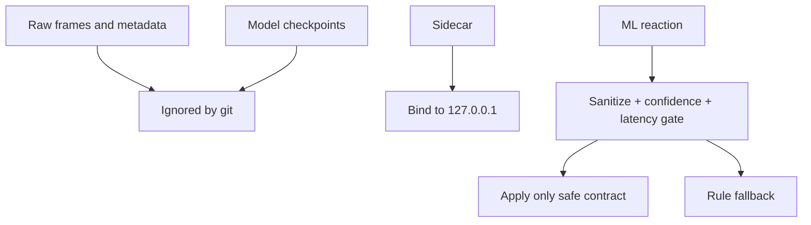

# Chapter 2 Raw-Pixel LeWorldModel Training Plan v1

**Project:** GiacMoCoTich
**Primary research target:** Chapter 2 boss arena
**Purpose:** Train and evaluate a raw-pixel LeWorldModel pipeline that can be compared against the current rule-based LeWM fallback.
**Status:** Implemented v1 training/review scaffold

## 1. Research Direction

The current research direction is intentionally narrow: focus Chapter 2 until the project has a strong report, then consider transfer to Chapter 1 and Chapter 3.

| Decision | Final choice |
|---|---|
| Dataset source | Combine human play and scripted self-play |
| Runtime controller | Use whichever performs better at runtime: ML if it passes gates, fallback otherwise |
| Training hardware | Use whichever performs better: benchmark CPU/CUDA, then keep `device: auto` and `precision: auto` |
| Chapter scope | Focus Chapter 2 until prediction, probe, sidecar, and gameplay reports are strong |



## 2. What Was Implemented

The implementation adds a reviewable raw-pixel LeWorldModel path without removing the existing deterministic rule baseline.

| Area | Files | Implementation summary |
|---|---|---|
| Godot recording | `scripts/shared/RawLeWMRecorder.gd` | Saves PNG frames, action rows, metadata rows, and episode descriptors |
| Chapter 2 scripted collection | `scripts/chapters/Chapter2Boss.gd` | Adds scripted self-play profiles for dataset coverage |
| Runtime ML/fallback selection | `scripts/shared/LeWMOrchestrator.gd` | Accepts ML only when confidence and latency gates pass |
| Sidecar checkpoint loading | `ml_sidecar/lewm_sidecar/runner.py` | Loads action/latent dimensions from trained checkpoints |
| Dataset loading | `research/lewm/lewm/datasets.py` | Converts Godot frame transitions and 8D action dictionaries into PyTorch samples |
| Diagnostics | `research/lewm/lewm/diagnostics.py` | Reports latent variance and effective rank |
| Training | `research/lewm/scripts/train.py` | Episode-safe train/validation split, AMP auto, checkpoints, metrics |
| Evaluation | `research/lewm/scripts/evaluate.py` | Exports prediction and latent diagnostics |
| Dataset inspection | `research/lewm/scripts/inspect_dataset.py` | Validates data integrity and human/scripted coverage |
| Device benchmark | `research/lewm/scripts/benchmark_device.py` | Benchmarks available devices before serious runs |

## 3. System Architecture

The system has three layers: Godot collection/runtime, Python research training, and Python sidecar inference.



## 4. Chapter 2 Action Representation

Chapter 2 now uses an 8-dimensional action vector. The previous 6D vector was not enough for bow dynamics because it omitted aim direction.

| Index | Field | Meaning |
|---:|---|---|
| 0 | `move_x` | Player horizontal movement |
| 1 | `move_y` | Player vertical movement |
| 2 | `attack` | Attack trigger |
| 3 | `dash` | Dash trigger |
| 4 | `weapon_id / 2` | Weapon mode, normalized |
| 5 | `boss_action_id / 6` | Current boss tactic context, normalized |
| 6 | `aim_x` | Aim direction x component |
| 7 | `aim_y` | Aim direction y component |



## 5. Dataset Strategy

The dataset should combine two kinds of data:

| Source | Why it is needed |
|---|---|
| Human play | Natural mistakes, hesitation, aiming patterns, real player rhythm |
| Scripted self-play | Fast coverage of specific behaviors, reproducible edge cases, balanced tactic triggers |

Scripted profiles currently available:

| Profile | Behavior |
|---|---|
| `mixed` | Cycles through all scripted profiles |
| `melee_spam` | Approaches boss and repeatedly attacks with axe |
| `kite_bow` | Keeps distance and fires bow |
| `corner_hold` | Holds a corner to trigger area denial |
| `switch_bait` | Alternates weapons to trigger timing reads |

Recommended collection stages:

| Stage | Episodes | Transitions | Goal |
|---|---:|---:|---|
| Smoke | 2+ | 100+ | Validate loader, split, loss, checkpoint writes |
| First useful run | 10+ | 5,000+ | Check whether latents remain stable |
| Review run | 30+ | 20,000+ | Compare ML and fallback behavior |
| Research run | 100+ | 100,000+ | Produce a stronger report |

## 6. Collection Commands

Human collection:

```powershell
powershell -ExecutionPolicy Bypass -File .\tools\collect_chapter2_lewm.ps1 `
  -Mode human `
  -ImageSize 128 `
  -CaptureInterval 0.10
```

Scripted collection:

```powershell
powershell -ExecutionPolicy Bypass -File .\tools\collect_chapter2_lewm.ps1 `
  -Mode scripted `
  -Profile mixed `
  -DurationSeconds 180 `
  -Seed 42
```

Output layout:

```text
ml_data/lewm_raw/chapter_2/
  episodes/
    ep_<timestamp>_<ticks>/
      frames/
        000000.png
        000001.png
      actions.jsonl
      metadata.jsonl
      episode.json
```

## 7. Dataset Inspection Gate

Inspect before training:

```bash
PYTHONPATH=research/lewm python3 research/lewm/scripts/inspect_dataset.py \
  --config research/lewm/configs/train_lewm_chapter2.yaml \
  --output models/lewm/chapter_2/dataset_inspection.json
```

Windows helper:

```powershell
powershell -ExecutionPolicy Bypass -File .\tools\inspect_lewm_dataset.ps1 -Chapter chapter_2
```

The inspection report checks:

- episode count,
- transition count,
- missing frame files,
- malformed JSONL rows,
- sampled image sizes,
- 8D action vector min/max,
- human vs scripted source mix,
- scripted profile coverage,
- metadata row count.



## 8. Training Pipeline

The v1 objective is reconstruction-free latent prediction:

```text
total_loss = prediction_loss(predicted_z_next, target_z_next)
           + gaussian_weight * gaussian_regularizer(latents)
```

The trainer uses episode-safe validation by default. This avoids leaking adjacent frames from the same episode into both train and validation.

```yaml
dataset:
  split_unit: episode

training:
  device: auto
  precision: auto
```



Train:

```bash
PYTHONPATH=research/lewm python3 research/lewm/scripts/train.py \
  --config research/lewm/configs/train_lewm_chapter2.yaml
```

Windows helper:

```powershell
powershell -ExecutionPolicy Bypass -File .\tools\train_lewm_chapter.ps1 -Chapter chapter_2
```

Training outputs:

```text
models/lewm/chapter_2/
  checkpoints/
    best.pt
    latest.pt
    split_report.json
  training_metrics.json
```

## 9. Device Benchmark

The project should not assume CPU or GPU. It should benchmark and use the faster available path.

```bash
PYTHONPATH=research/lewm python3 research/lewm/scripts/benchmark_device.py \
  --config research/lewm/configs/train_lewm_chapter2.yaml \
  --output models/lewm/chapter_2/device_benchmark.json
```

Windows helper:

```powershell
powershell -ExecutionPolicy Bypass -File .\tools\benchmark_lewm_device.ps1 -Chapter chapter_2
```



## 10. Evaluation Pipeline

Evaluate:

```bash
PYTHONPATH=research/lewm python3 research/lewm/scripts/evaluate.py \
  --config research/lewm/configs/train_lewm_chapter2.yaml \
  --checkpoint models/lewm/chapter_2/checkpoints/best.pt \
  --output models/lewm/chapter_2/evaluation.json
```

Windows helper:

```powershell
powershell -ExecutionPolicy Bypass -File .\tools\evaluate_lewm_checkpoint.ps1 -Chapter chapter_2
```

Key metrics:

| Metric | Interpretation |
|---|---|
| `prediction_loss` | Lower means predicted future latent is closer to target future latent |
| `gaussian_regularizer` | Tracks how stable the latent distribution is |
| `latent_variance_mean` | Too low can indicate representation collapse |
| `latent_variance_min` | Very low dimensions may be inactive |
| `latent_effective_rank` | Higher means more latent directions carry useful variation |

## 11. Runtime Selection

The runtime does not blindly trust ML. It uses `LeWMOrchestrator` as a gate.



Runtime flags:

```text
--lewm-mode=auto
--lewm-mode=ml
--lewm-mode=fallback
--lewm-min-confidence=0.55
--lewm-max-latency-ms=95
```

The default plan is `auto`: use ML when it performs well, otherwise keep the rule fallback.

## 12. Security and Artifact Policy

Raw captures and checkpoints are intentionally excluded from git.

Ignored artifacts:

- `ml_data/`
- `data/lewm_raw/`
- `models/lewm/`
- `*.pt`
- `*.pth`
- `*.ckpt`
- Python bytecode caches
- local Godot/Codex runtime files

Security rules:

1. Keep the sidecar on `127.0.0.1` during research.
2. Do not commit raw gameplay captures.
3. Do not commit model checkpoints.
4. Do not expose the sidecar publicly without authentication, request limits, and model artifact validation.
5. Keep deterministic rule fallback active for safety.



## 13. Chapter 2 Review Checklist

The first serious Chapter 2 report is ready when:

1. Dataset inspection shows both human and scripted episodes.
2. Validation is episode-safe.
3. Training creates `best.pt`, `latest.pt`, `split_report.json`, and `training_metrics.json`.
4. Evaluation shows non-collapsed latent diagnostics.
5. Sidecar loads the checkpoint and reports `model_loaded=true`.
6. Runtime `auto` mode chooses ML only when it is fast and confident.
7. Rule fallback remains available and stable.
8. A report compares random/fixed/rule fallback/raw-pixel LeWM behavior.
